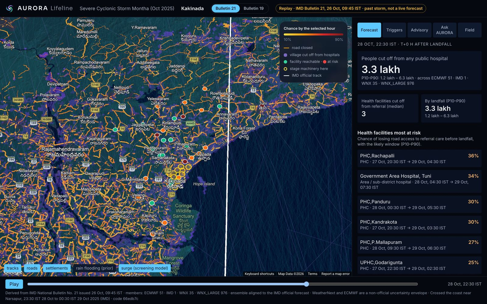
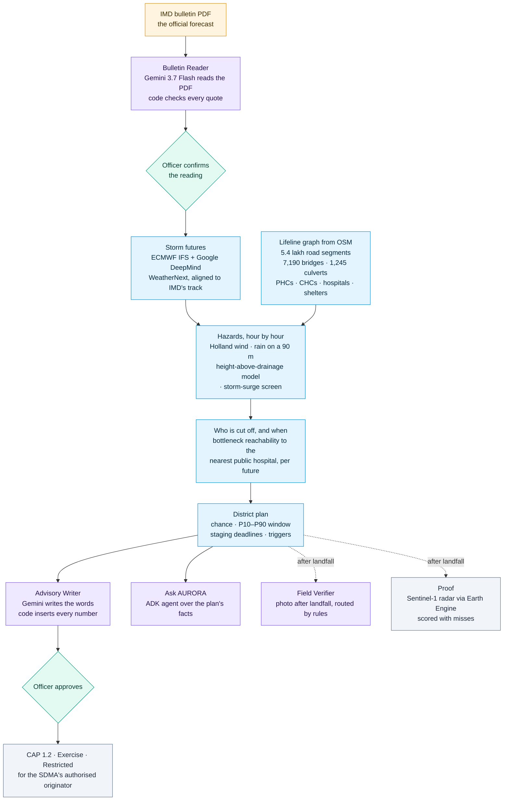
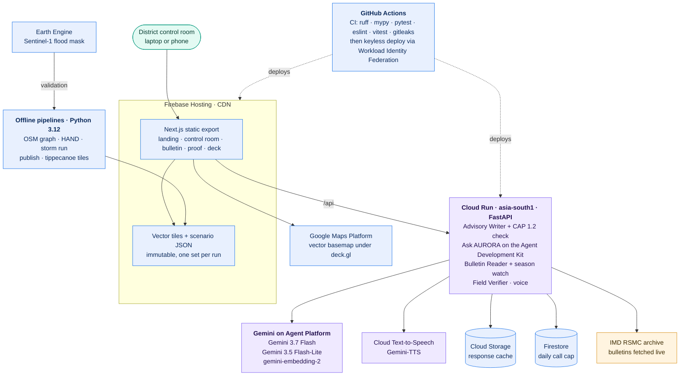
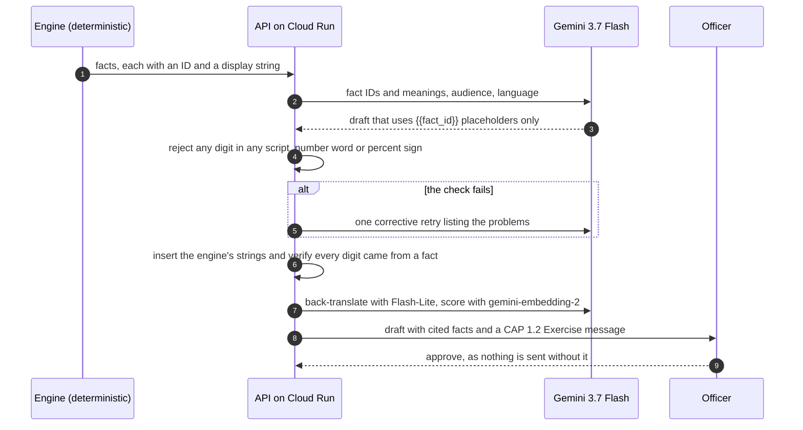
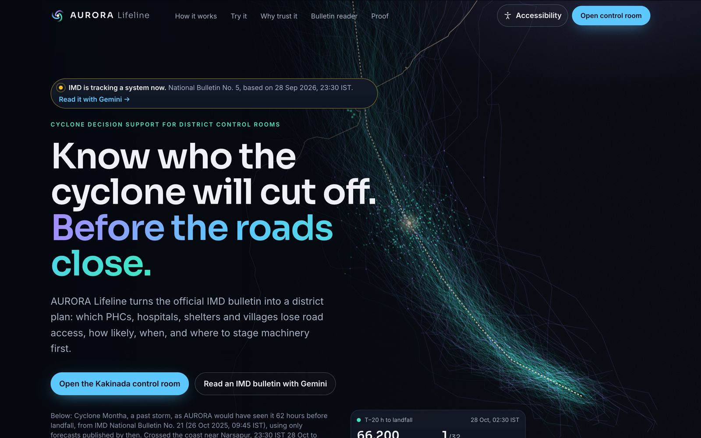
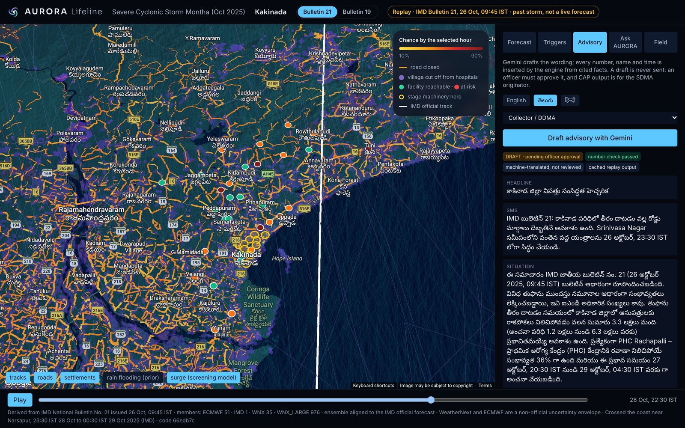
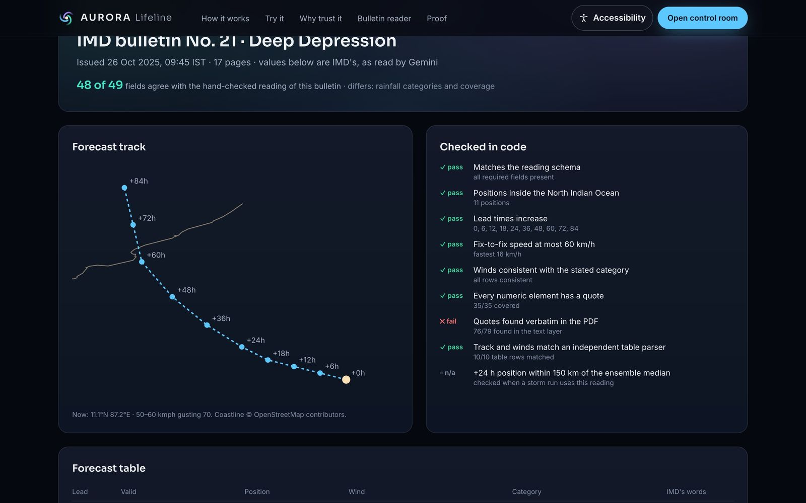
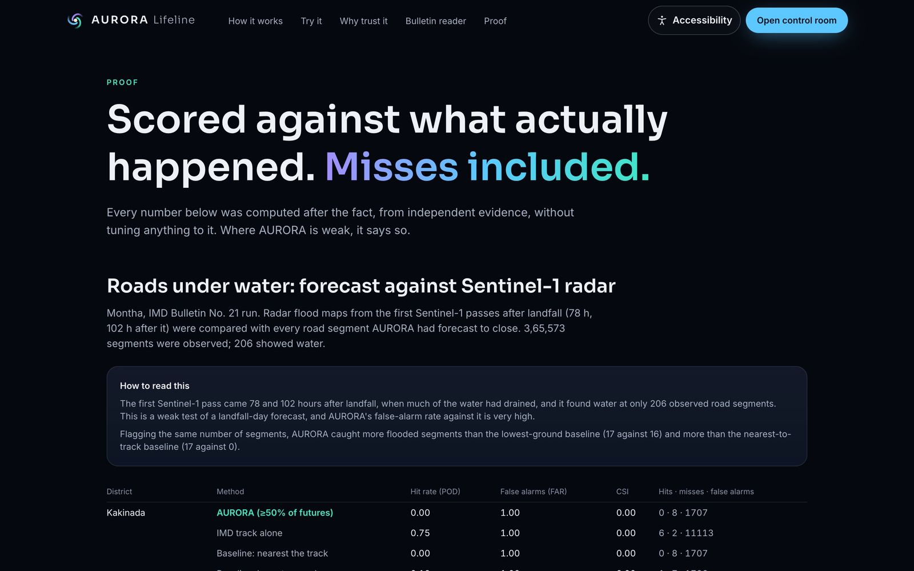
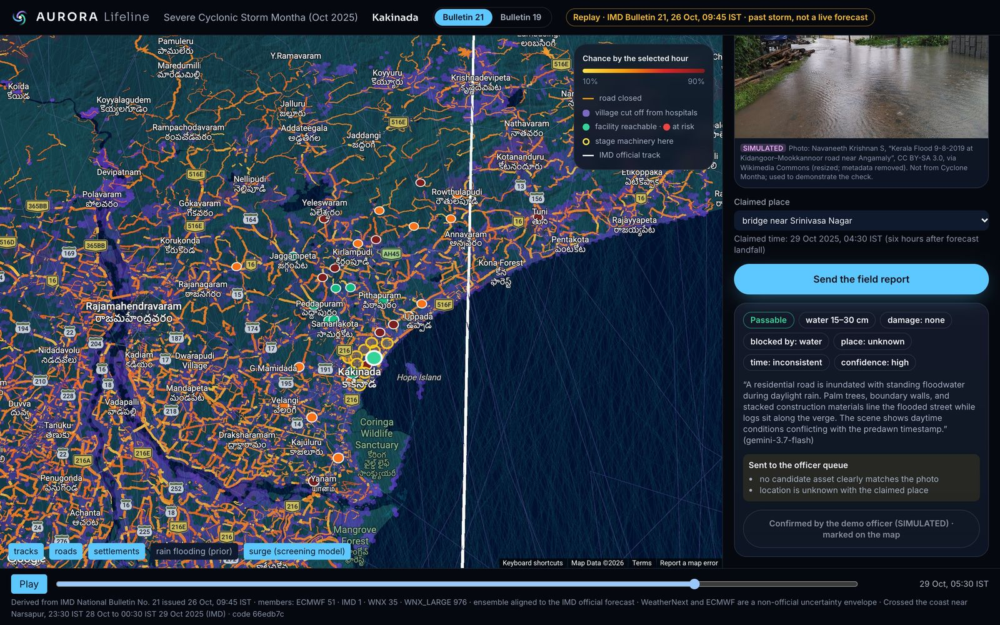
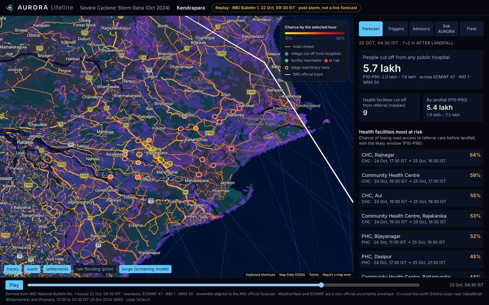

<div align="center">

<picture>
  <source media="(prefers-color-scheme: dark)" srcset="apps/web/public/brand/aurora-mark-dark-bg.svg">
  
</picture>

# AURORA Lifeline

**Know who the cyclone will cut off. Before the roads close.**

IMD tells you the storm. AURORA Lifeline tells you which PHC is cut off, how likely, when, and what to move there now.

[](https://github.com/TusharTechs/aurora-lifeline/actions/workflows/ci.yml)
[](https://github.com/TusharTechs/aurora-lifeline/actions/workflows/deploy.yml)
[](LICENSE)
[](https://aurora-lifeline.web.app)
[](https://youtu.be/sAHXhMi1_Vs)

_Track 05: Track-Based Cyclone Impact & Infrastructure Vulnerability Forecaster · Build with AI: Code for Communities, Second Edition_

</div>

| For judges: you want to…           | Go to                                                                                                                                                                                                                                               |
| ---------------------------------- | --------------------------------------------------------------------------------------------------------------------------------------------------------------------------------------------------------------------------------------------------- |
| **Watch it in five minutes**       | [Demo video](https://youtu.be/sAHXhMi1_Vs): the problem, then every feature end to end, narrated                                                                                                                                                    |
| **Try it now, nothing to install** | [Live app](https://aurora-lifeline.web.app): no sign-in · [Kakinada control room](https://aurora-lifeline.web.app/storm/montha_2025/district/13999862/): Cyclone Montha replay                                                                      |
| **Follow a guided tour**           | [Try it in five minutes](#try-it-in-five-minutes): eight clicks, every answer cached                                                                                                                                                                |
| **See a second state**             | [Dana, Kendrapara, Odisha](https://aurora-lifeline.web.app/storm/dana_2024/district/9588868/): same pipeline, configuration only                                                                                                                    |
| **Read the pitch**                 | [Deck](https://aurora-lifeline.web.app/deck/): eleven slides, printable · [submission text](docs/SUBMISSION_FIELDS.md)                                                                                                                              |
| **See the Google AI at work**      | [Google AI](#google-ai-in-the-product): each model's job · [Bulletin Reader](https://aurora-lifeline.web.app/bulletin/): Gemini reads a live IMD PDF · [prompts](https://aurora-lifeline.web.app/about/): open in AI Studio                         |
| **Check the guardrails**           | [Guardrails](#guardrails) · [number check](agents/aurora_agents/numbers.py): no Gemini-written digits · [real versus simulated](#real-versus-simulated)                                                                                             |
| **Check the results**              | [Proof page](https://aurora-lifeline.web.app/proof/): Sentinel-1, misses included · [validation](#validation-misses-included): the figures · [agent evaluation](docs/eval-results.md): Bulletin Reader scores                                       |
| **Read the architecture and code** | [Architecture diagrams](#architecture) · [ARCHITECTURE.md](docs/ARCHITECTURE.md) · [ENGINE.md](docs/ENGINE.md): algorithms and parameters · [AI_AGENTS.md](docs/AI_AGENTS.md): prompts and schemas · [DATA.md](docs/DATA.md): datasets and licences |
| **Judge deployability**            | [CI](.github/workflows/ci.yml): tests and secret scan · [deploy](.github/workflows/deploy.yml): keyless · [Cloud Shell setup](infra/cloudshell/): one-time · [COSTS.md](docs/COSTS.md): US$150 budget                                               |
| **Score it against the criteria**  | [Judging criteria](#where-to-find-each-judging-criterion): evidence per criterion                                                                                                                                                                   |
| **Use the API**                    | [11 operations](https://aurora-lifeline.web.app/api/docs), with an OpenAPI document at `/api/openapi.json`                                                                                                                                          |
| **Run it yourself**                | [Run it locally](#run-it-locally): `make setup`, `make replay`, `make web`                                                                                                                                                                          |
| **Know the limits**                | [What it does not do yet](#limits) · [decision log](docs/HANDOFF.md): every choice and why                                                                                                                                                          |

<p align="center"></p>

<p align="center"><sub>Cyclone Montha (Oct 2025), Kakinada, replayed from IMD Bulletin No. 21, 62 hours before landfall. Orange roads are likely to close; red and orange dots are health facilities at risk; yellow rings are where to stage earthmovers.</sub></p>

## The problem

India's cyclone warnings now save lives at scale. What still fails is the **lifeline**: when a storm crosses the coast, the roads to PHCs and hospitals flood, bridges and culverts close, and villages are cut off from care for days.

IMD's bulletin says where the storm will go and how strong it will be. It does not tell a District Collector:

- which PHC will lose its last road to a hospital;
- how likely that is, and when;
- what to move there before it happens.

Today that translation is done by phone calls and experience, in the 48–72 hours when it matters most.

## What AURORA Lifeline does

From one official IMD bulletin, for every road, bridge, culvert, health facility and village in a coastal district, AURORA Lifeline answers four questions:

| Question                 | Answer on screen (Kakinada, Montha, Bulletin 21)                                                                                                                                 |
| ------------------------ | -------------------------------------------------------------------------------------------------------------------------------------------------------------------------------- |
| **Who** will be cut off? | 3.3 lakh people likely to lose road access to any public hospital by landfall (P10–P90: 1.2–6.3 lakh), and the named PHCs and hospitals most at risk                             |
| **How likely?**          | A chance for each facility across 1,062 ensemble storm futures plus IMD's own track (PHC Rachapalli: 36%)                                                                        |
| **When?**                | A P10–P90 window, never a falsely precise single hour (PHC Rachapalli: 27 Oct 20:30 to 29 Oct 04:30 IST)                                                                         |
| **What to move?**        | Ranked earthmover staging sites, each with a deadline and its basis (first site: "by 26 Oct, 23:30 IST", basis "P10 closure − 6 h"), and indicative anticipatory-action triggers |

It then drafts the advisory in **English, Telugu or Hindi**, reads it aloud, and exports a **CAP 1.2** message for the SDMA's authorised originator. **Nothing is sent without officer approval.** After landfall, it checks field photos and routes them to the map or to an officer.

## Try it in five minutes

No sign-in. Every Gemini answer on this path is cached, so it is instant and identical for every judge.

1. **[Landing page](https://aurora-lifeline.web.app):** the storm futures sweep to the coast. The season-watch strip shows whether IMD is tracking a system today.
2. **[Bulletin Reader](https://aurora-lifeline.web.app/bulletin/):** click _Montha · National Bulletin No. 21_. Gemini reads the PDF, and code checks every value against the PDF text and an independent table parser. The failed check is shown too. Click _LIVE_ to read IMD's latest bulletin.
3. **[Kakinada control room](https://aurora-lifeline.web.app/storm/montha_2025/district/13999862/):** press _Play_ and watch roads close towards landfall. Switch _Bulletin 21_ / _Bulletin 19_ to see how the forecast changed.
4. **Advisory tab:** choose _తెలుగు_ and _Draft advisory with Gemini_. Open _Show what Gemini wrote (placeholders)_ to see the placeholders, then _Listen (Gemini-TTS)_ and _Download CAP 1.2 (Exercise)_.
5. **Ask AURORA tab:** click _"Where should we pre-position JCBs first, and by when?"_. It gives an answer with citations, and no number the tools did not return.
6. **Field tab:** _Use the demo photo_, then _Send the field report_. Gemini assesses the photo, and fixed rules send it to the officer queue.
7. **[Proof](https://aurora-lifeline.web.app/proof/):** the Sentinel-1 radar scores, misses included.
8. **[Second storm: Dana, Kendrapara, Odisha](https://aurora-lifeline.web.app/storm/dana_2024/district/9588868/):** the same pipeline in another state, by configuration alone.

## Architecture

### From an IMD bulletin to a district plan



### What runs where on Google Cloud



**Static first.** Viewers read immutable tiles and JSON from the CDN; they never call Earth Engine or run the engine. Only the Gemini features and the season watch reach Cloud Run, which scales to zero. Those calls are cached by input hash, rate-limited per IP and capped per day.

### Gemini writes words; code writes numbers



The same rule guards Ask AURORA (an after-model callback blocks any figure the tools did not return) and the Field Verifier (its notes are checked the same way).

## Google AI in the product

Every Google model here has a job; none is a chatbot bolted on.

| Google technology                                                                                       | What it does in AURORA Lifeline                                                                                                                 |
| ------------------------------------------------------------------------------------------------------- | ----------------------------------------------------------------------------------------------------------------------------------------------- |
| **Gemini 3.7 Flash** (Agent Platform)                                                                   | Reads IMD bulletin PDFs (text and tables) into a checked, quoted reading; drafts advisories in English, Telugu and Hindi; assesses field photos |
| **Agent Development Kit**                                                                               | Ask AURORA: an agent over five read-only tools, with an after-model number guard and a facts-table fallback                                     |
| **Gemini 3.5 Flash-Lite + gemini-embedding-2**                                                          | Back-translate Telugu and Hindi drafts and score them against the English draft (0.95 for Kakinada); low scores are flagged to the officer      |
| **Cloud Text-to-Speech Gemini-TTS**                                                                     | Reads approved advisories aloud in Telugu, Hindi and English                                                                                    |
| **Google DeepMind WeatherNext** (Weather Lab)                                                           | 1,011 of Montha's 1,062 ensemble futures; 50 of Dana's 97                                                                                       |
| **Earth Engine**                                                                                        | Sentinel-1 radar flood mapping for the proof page                                                                                               |
| **Google Maps Platform**                                                                                | Vector basemap under the deck.gl overlay                                                                                                        |
| **Cloud Run, Firebase Hosting, Cloud Storage, Firestore, Secret Manager, Workload Identity Federation** | API, static site and tiles, Gemini response cache, spend cap, secrets, keyless deploys from GitHub                                              |

The prompts can be opened in Google AI Studio from the [About page](https://aurora-lifeline.web.app/about/).

## Guardrails

- **Gemini never produces an AURORA number.** Probabilities, counts, times and depths come from the deterministic engine and are inserted by code.
- **IMD is the authority.** The IMD bulletin drives every run; the ensembles are a labelled, non-official uncertainty envelope. The control room shows the bulletin number and the ensemble behind every figure.
- **Humans approve.** No advisory is sent without an officer. Field reports below the confidence threshold, and every bridge reopening, go to an officer. AURORA never issues public alerts: CAP output is marked `Exercise` and `Restricted` for the SDMA's authorised originator.
- **Uncertainty is shown honestly.** A chance plus a P10–P90 window, never a single hour. Uncalibrated parameters are labelled "prior", and validation is published with its misses.
- **Simulated is labelled.** The demo officer, the demo field photo and its confirmation carry a visible SIMULATED badge.
- **No personal data.** Field photos have their metadata read and then removed before the model sees them.

## Validation, misses included

The [proof page](https://aurora-lifeline.web.app/proof/) scores forecasts against independent evidence, computed after the fact without tuning anything to it.

**Roads under water, against Sentinel-1 radar** (Montha, Bulletin 21 run):

- 365,573 road segments were observed by the first radar passes, 78 and 102 hours after landfall, when much of the water had drained. Only 206 segments showed water, so this is a weak test of a landfall-day forecast.
- Flagging the same number of segments, AURORA caught 17 flooded segments. The lowest-ground baseline caught 16, and the nearest-to-track baseline caught none.
- AURORA's false-alarm rate against this radar is very high (FAR 0.998). In Kakinada it caught none of 8 flooded segments; in Konaseema it caught 5 of 7.

**Bulletin Reader against hand-checked labels:**

- 48 of 49 fields agree on Montha bulletins 19 and 21.
- On IMD's live 2026 bulletin, every applicable check passes.

Details: [`docs/eval-results.md`](docs/eval-results.md).

## Where to find each judging criterion

| Criterion (weight)                      | Evidence                                                                                                                                                                                                                                                                                      |
| --------------------------------------- | --------------------------------------------------------------------------------------------------------------------------------------------------------------------------------------------------------------------------------------------------------------------------------------------- |
| **AI / technical execution (25%)**      | Gemini reads PDFs with deterministic checks; the placeholder number guard; an ADK agent with tool-only figures; Gemini photo checks with rule-based routing. Behind them, an ensemble engine: 1,063 futures across 5.4 lakh segments in 83 s on 7 cores. 115 Python and 7 web tests run in CI |
| **Problem–solution fit (20%)**          | The four questions a Collector asks, answered per facility from the official IMD bulletin, with deadlines, triggers and CAP output for the SDMA's existing channel ([control room](https://aurora-lifeline.web.app/storm/montha_2025/district/13999862/))                                     |
| **Depth and reach across India (20%)**  | Two states and two storms (Andhra Pradesh: Montha 2025; Odisha: Dana 2024) from configuration alone; advisories and voice in Telugu, Hindi and English. Every input except the IMD bulletin is global open data, and CAP 1.2 is an international standard                                     |
| **Deployability and scalability (20%)** | A static CDN-first site; an API on Cloud Run that scales to zero; keyless CI/CD; per-IP limits, a daily model-call cap and response caching within a US$150 budget. A new state needs a YAML file, a district CSV and an OSM extract (`config/states/`)                                       |
| **Impact (15%)**                        | 62 hours before Montha's landfall: 3.3 lakh people in Kakinada likely to be cut off from any public hospital, and the PHCs to act on first, each with a window and a deadline                                                                                                                 |

## Screenshots

| Landing page                                                                                                                                 | Advisory in Telugu, with checks                                                                                                         |
| -------------------------------------------------------------------------------------------------------------------------------------------- | --------------------------------------------------------------------------------------------------------------------------------------- |
|                                               |  |
| **Bulletin Reader: checked in code**                                                                                                         | **Proof: scored against Sentinel-1**                                                                                                    |
|         |                                        |
| **Field report: Gemini assesses, rules route it**                                                                                            | **Second state: Dana, Kendrapara, Odisha**                                                                                              |
|  |                  |

## Real versus simulated

- **Real:** IMD bulletins, the ECMWF and WeatherNext ensembles, OSM roads and facilities, population, terrain, Sentinel-1 radar, and every forecast figure.
- **Simulated and labelled:** the officer approval and field-report confirmation in the demo; the demo field photo (an openly licensed 2019 Kerala flood photo, credited, standing in for a field team's photo). CAP messages are status `Exercise`.
- **Not in this build:** power-grid outage estimates, SMS and IVR delivery, field reports by voice note or WhatsApp.

## Repository

```
engine/aurora_engine/     tracks, wind, rain, surge, HAND, graph, reachability, weights (Python 3.12)
pipelines/                OSM extraction, graph build, storm run, publish, tiles, Sentinel-1 mask and scoring
agents/aurora_agents/     Bulletin Reader, Advisory Writer, CAP 1.2, Ask AURORA (ADK), Field Verifier, voice, number safety
services/api/             FastAPI on Cloud Run
apps/web/                 Next.js static site (deck.gl over the Google Maps vector basemap)
schemas/                  JSON Schemas (source of truth for Python and TypeScript types) and the CAP 1.2 XSD
config/                   states, districts and storm replay definitions
infra/cloudshell/         one-time Cloud Shell setup: APIs, service accounts, keyless deploys, Sentinel-1 export
docs/                     spec, architecture, engine, agents, data, build plan, costs, handoff
```

Design documents: [spec](docs/SPEC.md) · [architecture](docs/ARCHITECTURE.md) · [engine algorithms](docs/ENGINE.md) · [AI agents](docs/AI_AGENTS.md) · [data register](docs/DATA.md) · [costs](docs/COSTS.md) · [decision log](docs/HANDOFF.md).

**Why two branches?** `main` holds the code. `web-data` holds the generated map tiles and run JSON as a single commit, replaced on each publish (`make web-data`); CI and deploys unpack it. It is never merged into `main`.

## Run it locally

Requirements: uv, pnpm, Node 22+, tippecanoe, Java 21 (Firebase emulators) and gitleaks. `make setup` checks for them and installs the rest.

```bash
make setup
make download                       # public raw data, no sign-in
make graph STATE=andhra_pradesh     # height-above-drainage and the road graph for the delta districts
make replay STORM=montha_2025       # storm run and district JSON
make tiles STORM=montha_2025        # vector tiles and overlays
make web                            # http://localhost:3000
make test                           # ruff, mypy, pytest, eslint, vitest
```

Cloud setup (once, from Cloud Shell) is in [`infra/cloudshell/`](infra/cloudshell/). After that, every green CI run on `main` deploys the API and the site.

## Limits

- Surge is a screening upper bound, not a hydrodynamic model; IMD surge guidance takes precedence.
- Riverine inflow from upstream districts is not modelled; closures never reopen within a run.
- Road data is OpenStreetMap; facilities with no mapped route are flagged, not guessed.
- Weather Lab / WeatherNext outputs are experimental, are not produced with or endorsed by any government meteorological agency, and are shown only as a non-official uncertainty envelope.

AURORA Lifeline is not an official warning service. IMD is the authoritative source for cyclone warnings in India.

## Data and credits

Map data © OpenStreetMap contributors (ODbL). Population: WorldPop (CC BY 4.0). Terrain: produced using Copernicus WorldDEM-30 © DLR e.V. 2010-2014 and © Airbus Defence and Space GmbH 2014-2018 provided under COPERNICUS by the European Union and ESA; all rights reserved. Height above nearest drainage (Sentinel-1 mask filter): MERIT Hydro (Yamazaki et al., 2019). Surface water: Source: EC JRC/Google. Radar: Contains modified Copernicus Sentinel data [2025]. Tracks: ECMWF open data (CC BY 4.0); Google DeepMind Weather Lab / WeatherNext (CC BY 4.0 historical data). Verification: IBTrACS (NOAA NCEI). Official forecasts: India Meteorological Department (RSMC New Delhi); IMD bulletins are read from IMD's archive and never re-hosted. Basemap: Google Maps Platform. CAP 1.2: OASIS. Demo field photo: "Kerala Flood 9-8-2019 at Kidangoor–Mookkannoor road near Angamaly" by Navaneeth Krishnan S, [CC BY-SA 3.0](https://creativecommons.org/licenses/by-sa/3.0/), via [Wikimedia Commons](https://commons.wikimedia.org/wiki/File:Kerala_Flood_9-8-2019_at_Kidangoor_-Mookkannoor_road_near_Angamaly.jpg); resized and metadata removed (`apps/web/public/demo/`).

Method references: Holland (1980) for the wind profile; Barnes et al. (2014) priority-flood; Pregnolato et al. (2017) for the 0.3 m passability depth; UN-SPIDER recommended practice for Sentinel-1 flood mapping.

Open-source components include numpy, pandas, geopandas, shapely, rasterio, pyosmium, h3, numba, scipy, pydantic, pillow, FastAPI, google-genai, google-adk, earthengine-api, Next.js, React, deck.gl, vis.gl react-google-maps, Tailwind CSS, Fontsource (SIL OFL fonts) and tippecanoe (build-time only). Licences are listed in each package; no GPL or AGPL code is imported or shipped.

## AI tools disclosure

We used **Gemini 3.6 Flash** for research and conceptualization of the idea, and **Claude Opus 5.5** for coding and development. Every dataset, method and result was checked by running the pipelines and the deployed service, and the design decisions and their reasons are recorded in [`docs/HANDOFF.md`](docs/HANDOFF.md). These tools helped build the project; the AI that runs inside the product is described in [Google AI in the product](#google-ai-in-the-product).

## Licence

Apache-2.0. See [`LICENSE`](LICENSE).
