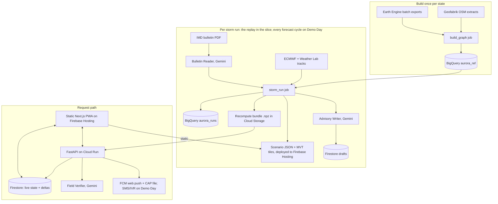

# Architecture: AURORA Lifeline

The design rule is: **precompute everything slow, serve results as static files, and keep Gemini and Earth Engine out of the viewer request path.**

## 1. Overview



## 2. Components

| Component | Runtime | Responsibility |
| --- | --- | --- |
| `apps/web` | Next.js with `output: 'export'` (no SSR; no framework-aware Firebase deploy), on Firebase Hosting | Judge landing page, command map, approvals, field form, proof and about pages. `generateStaticParams` covers storms and districts, with `dynamicParams = false`. `/field` and `/approvals` are client-only |
| `services/api` | FastAPI on Cloud Run, asia-south1, 2 GiB, concurrency 80, max-instances 10; min-instances 0, or 1 during 1–23 Oct | Endpoints for approvals, field reports (signed upload URLs), verify and confirm, CAP generation and validation, dispatch. **Slice recompute:** at startup it loads the demo district's recompute bundle; on confirm it reruns `docs/ENGINE.md` §7 in memory and writes Firestore deltas. Nearest-asset lookup uses the same bundle's KD-tree |
| `pipelines/ee_exports` | Cloud Run job, or a local run | Earth Engine batch exports clipped to `config/aoi/<state>.geojson`: DEM, drainage height, surface water, Open Buildings centroids, WorldPop, IMERG; Sentinel-1 for validation; VIIRS on Demo Day |
| `pipelines/build_graph` | Cloud Run job, 8 vCPU / 32 GiB | OSM → road graph (bridges, culverts and fords as edges) → facilities → H3 settlements → substation service areas → completeness → `aurora_ref` |
| `pipelines/storm_run` | Cloud Run job, 8 vCPU / 32 GiB | Tracks → hazards → closures → isolation, power, health → actions → BigQuery, static JSON and tiles, recompute bundle, Firestore summaries, advisory drafts |
| `pipelines/backtest` | Cloud Run job | Sentinel-1 road scoring, baselines, surge table → `aurora_eval` and proof-page JSON |
| `pipelines/archiver` (DD) | Cloud Run job every 6 h | Snapshots IMD, ECMWF, Weather Lab and Sachet. For live storms it commits only **hashes** publicly; forecasts are published after landfall |
| `pipelines/recompute` (DD) | Cloud Run job, Eventarc-triggered | Full-state recompute and re-publication, replacing the in-API slice path |
| `agents/*` | Python modules | See `docs/AI_AGENTS.md` |

## 3. Configuration

Geography and storms are configuration.

```yaml
# config/states/andhra_pradesh.yaml
state_lgd: null                    # fill from LGD
name: Andhra Pradesh
osm_extract: southern-zone-latest.osm.pbf
aoi: config/aoi/andhra_pradesh.geojson   # 120 km coastal buffer ∩ state polygon
districts_csv: config/states/andhra_pradesh_districts.csv   # lgd_code, name, osm_relation_id, name_variants (post-2022 AP districts)
crude_birth_rate_per_1000: null    # from the SRS statistical report; cite the year
```

```yaml
# config/states/odisha.yaml
state_lgd: null
name: Odisha
osm_extract: eastern-zone-latest.osm.pbf
aoi: config/aoi/odisha.geojson
districts_csv: config/states/odisha_districts.csv
crude_birth_rate_per_1000: null
```

```yaml
# config/storms/montha_2025.yaml
storm_id: montha_2025
status: replay
basin: NI
ibtracs_sid: null        # verification labels only
landfall_utc: null       # member-0 hourly track's first OSM-coastline crossing (SPEC §3); a model input
observed_landfall_utc: null   # IMD's observed landfall (post-landfall bulletin or report); used for selection only
replay_start_utc: null   # observed landfall minus 72 h; used for selection only
demo_bulletin_no: null   # rule in SPEC §3
imd_bulletins_gcs: gs://<bucket>/storms/montha_2025/imd/
ecmwf_tracks_gcs: gs://<bucket>/storms/montha_2025/ecmwf/
weatherlab_tracks_gcs: gs://<bucket>/storms/montha_2025/weatherlab/
states: [andhra_pradesh, odisha]
demo_district_lgd: null  # the AP district (Oct 2025 district set) containing member 0's forecast coast crossing
```

```yaml
# config/storms/montha_2025_demo.yaml — the demo-officer sandbox (SPEC §2)
storm_id: montha_2025_demo
status: replay
sandbox_of: montha_2025   # same run_id and static files; separate Firestore subtree; reset nightly
```

## 4. Data flow per storm run

1. **Resolve inputs** by the replay rule (SPEC §3). Never use data issued after the bulletin's issue time. Best tracks are used for verification only.
2. **Bulletin Reader** (Gemini) turns the IMD PDF into a `BulletinReading`, then deterministic checks run. The result goes to `aurora_runs.bulletins`. Before 3.1 is built, member 0 may be hand-entered from the PDF, with `source_note: "hand-entered"`.
3. **Tracks:** normalise, interpolate hourly, apply authority alignment (`docs/ENGINE.md` §2).
4. **Hazards** (§3–5), **closures** (§6), **isolation** (§7), **power and health** (§8), **actions** (§9).
5. **Publish:**
   - BigQuery;
   - `runs/<run_id>/districts/<lgd>.json` (district scenario), `tiles/<run_id>/...`, `runs/<run_id>/manifest.json`;
   - `runs/<run_id>/recompute/<lgd>.npz` (at most 50 MB);
   - Firestore `storms/{id}` and `storms/{id}/districts/{lgd}`;
   - advisory drafts.

   Static files go into the Hosting deploy directory and are deployed once per run.

## 5. Contract schemas (`schemas/`, JSON Schema draft-07)

Codegen uses datamodel-code-generator (MIT) for Pydantic v2 and json-schema-to-typescript (MIT) for TypeScript. The engine and the web app must both use the generated types.

**`facts_payload`**

```json
{"run_id": "string", "district_lgd": "string", "audience": "string", "langs": ["bcp47"],
 "facts": [{"id": "^[a-z0-9_]+$", "kind": "probability|count|time|time_window|place|provenance|text",
            "value": "number|string|null", "unit": "string|null", "required": true,
            "text": {"<bcp47>": "string rendered by the engine"}, "source": {"table": "string", "row_id": "string"}}]}
```

**`district_scenario`** (at most 1 MB; `runs/<run_id>/districts/<lgd>.json`)

```json
{"schema_version": "1", "run_id": "", "storm_id": "", "storm_status": "replay|live", "district_lgd": "", "district_name": "",
 "provenance": {"imd_bulletin_no": "", "imd_issued_at_utc": "", "members": {"IMD": 1, "ECMWF": 0, "WNX": 0},
                "mode": "ensemble|deterministic", "data_versions": {}, "code_sha": "", "model_ids": {}},
 "time_axis": {"now_utc": "", "landfall_utc": "", "step_h": 1, "n_steps": 0},
 "headline": {"pop_cut_hospital": {"p10": 0, "p50": 0, "p90": 0},
              "facilities_at_risk": {"p10": 0, "p50": 0, "p90": 0},
              "pop_served_by_substations_at_risk": {"p10": 0, "p50": 0, "p90": 0, "class": null}, "at": "landfall"},
 "hourly": [{"t_utc": "", "pop_cut_p10": 0, "pop_cut_p50": 0, "pop_cut_p90": 0, "pop_power_risk_p50": 0, "facilities_at_risk": 0}],
 "facilities": [{"facility_id": "", "type": "", "name": "", "lat": 0, "lon": 0, "is_simulated": false,
                 "p_isolated_by_landfall": 0, "t10": "", "t50": "", "t90": "", "iso_deciles": ["9 ISO times or null"],
                 "referral_p_isolated": 0, "power": {"p": null, "class": "likely|possible|unlikely|null"},
                 "expected_births_window": {"p10": 0, "p50": 0, "p90": 0}, "badges": []}],
 "actions": [{"action_id": "", "type": "", "target_id": "", "deadline_utc": "", "deadline_basis": "P10 closure - 6 h",
              "people_protected": 0, "p_event": 0, "rank": 1, "evidence_ref": ""}],
 "completeness": {"badge": "good|partial|poor", "phc_ratio": 0, "chc_ratio": 0, "substations_mapped": 0},
 "tiles": {"url_template": "/tiles/<run_id>/{layer}/{z}/{x}/{y}.pbf",
           "layers": ["edges", "settlements", "facilities", "surge", "flood", "tracks"], "minzoom": 6, "maxzoom": 14},
 "flags": {"needs_review": false, "screening_surge": true, "prior_params": ["names"]}}
```

**MVT feature properties**

- `edges`: `edge_id`, `road_class`, `crossing_type`, `t_close_p10`, `t_close_p50`, `t_close_p90` (hours since `now_utc`, or null for never), `p_close_by_landfall`.
- `settlements`: `settlement_id`, `population`, `p_cut`, `t10`, `t50`, `t90`, deciles.
- `facilities`: `facility_id`, `type`, `p_isolated_by_landfall`.
- `surge`, `flood`: polygons with `t_onset_p50` (hours since `now_utc`; null = never), `p_by_landfall`, `depth_max_m`. Drawn when t ≥ `t_onset_p50`.
- `tracks`: lines with `source`, `member_no`, `is_official`.

Build the tiles with one tippecanoe run per layer: `tippecanoe -e tiles/<run_id>/<layer> -l <layer> --no-tile-compression`. This matches `/tiles/<run_id>/{layer}/{z}/{x}/{y}.pbf`.

**Client rules:** at slider time t, an edge is drawn closed when t ≥ `t_close_p50`. Shading is P(closed by t), interpolated from the deciles or percentiles.

**`run_manifest`**

```json
{"run_id": "", "storm_id": "", "created_at_utc": "", "code_sha": "", "imd_bulletin_no": "",
 "inputs": [{"uri": "", "sha256": "", "source": "", "issued_at_utc": ""}],
 "members": [{"source": "", "member_no": 0}],
 "parameters": [{"name": "", "value": null, "status": "PRIOR|CONFIRMED|CALIBRATED", "source": ""}],
 "models": [{"id": "", "prompt_version": ""}], "seed": 0,
 "outputs": [{"path": "", "sha256": "", "bytes": 0}]}
```

Agent schemas (`bulletin_reading`, `field_observation`, `advisory_draft`) are in `docs/AI_AGENTS.md`.

## 6. BigQuery schema

Datasets live in asia-south1. Partition run tables by `run_date` and cluster by `storm_id` and `district_lgd`.

### `aurora_ref`

| Table | Key columns |
| --- | --- |
| `nodes` | `node_id`, `state_lgd`, `district_lgd`, `geom`, `elev_m`, `hand_m` |
| `edges` | `edge_id`, `u`, `v`, `osm_way_id`, `road_class`, `crossing_type` (none/bridge/culvert/ford), `length_m`, `travel_time_s`, `geom`, `midpoint`, `min_elev_m`, `min_hand_m`, `coast_dist_km` |
| `facilities` | `facility_id`, `type` (district_hospital/sdh_area_hospital/chc/phc/sub_centre/shelter; `delivery_point` and `dialysis` only from official lists), `name`, `source`, `class_confidence`, `geom`, `node_id`, `snap_dist_m`, `capacity`, `is_simulated` |
| `settlements` | `settlement_id` (H3 r8), `geom` (centroid), `hull` (the H3 cell), `population`, `buildings` (nullable), `node_id`, `district_lgd` |
| `substations` | `substation_id`, `osm_id`, `voltage_kv`, `geom`, `node_id` |
| `service_areas` | `substation_id`, `settlement_id`, `network_dist_m` |
| `completeness` | `district_lgd`, `phc_mapped`, `phc_official`, `chc_mapped`, `chc_official`, `substations_mapped`, `badge` |

### `aurora_runs`

| Table | Key columns |
| --- | --- |
| `runs` | `run_id`, `storm_id`, `imd_bulletin_no`, `mode`, `members`, `code_sha`, `data_versions`, `models`, `status` |
| `bulletins` | `run_id`, `reading` JSON, `checks` JSON, `needs_review`, `source_note` |
| `tracks` | `run_id`, `source`, `member_no`, `valid_at`, `lat`, `lon`, `vmax_ms`, `pmin_hpa`, `rmw_km`, `aligned` |
| `edge_closure` | `run_id`, `member_key`, `edge_id`, `t_close` (NULL = never), `cause`, `max_depth_m` |
| `node_isolation` | `run_id`, `member_key`, `target_class`, `node_id`, `b_time`. Facility and settlement nodes only; all nodes go to Parquet in Cloud Storage if needed |
| `facility_risk` | `run_id`, `facility_id`, `p_isolated_by_landfall`, `t10`, `t50`, `t90`, `referral_p_isolated`, `power_p`, `power_class`, `births_p10/p50/p90`, `pop_catchment` |
| `settlement_risk` | `run_id`, `settlement_id`, `p_cut_from_hospital`, `t10`, `t50`, `t90`, `power_p`, `population` |
| `district_summary` | `run_id`, `district_lgd`, `hour`, `pop_cut_p10`, `pop_cut_p50`, `pop_cut_p90`, `pop_power_risk_p50`, `facilities_at_risk` |
| `actions` | `run_id`, `action_id`, `type`, `target_id`, `deadline`, `deadline_basis`, `people_protected`, `p_event`, `evidence`, `rank` |

### `aurora_eval`

| Table | Key columns |
| --- | --- |
| `observed_flood_edges` | `storm_id`, `edge_id`, `observed_flooded`, `s1_scene_ids`, `obs_time`, `observed` (false = no scene) |
| `road_skill` | `storm_id`, `run_id`, `method`, `pod`, `far`, `csi`, `hits`, `misses`, `false_alarms`, `districts_not_observed` |
| `power_skill` (DD) | `storm_id`, `run_id`, `auc`, `n_areas`, `method` |
| `bulletin_eval` | `bulletin_id`, `field`, `expected`, `got`, `correct`, `labelled_by` (human/draft; only human counts) |
| `verifier_eval` | `image_id`, `label`, `predicted`, `confidence_band` |

## 7. Firestore `(default)`

| Path | Contents | Writer |
| --- | --- | --- |
| `storms/{stormId}` | name, status (replay/live), latest `run_id`, landfall, headline with windows, provenance | storm_run |
| `storms/{stormId}/districts/{lgd}` | summary, `scenario_url`, `tiles_url`, completeness badge | storm_run, API |
| `storms/{stormId}/districts/{lgd}/deltas/{seq}` | changed facility and settlement rows after a confirmed field report | API (recompute) |
| `advisories/{id}` | `storm_id`, `district_lgd`, `lang`, draft, `facts_hash`, status (draft/approved/dispatched/rejected), `approved_by` (uid), `approved_at`, `cap_xml_url`, `audio_url`, `is_simulated` | Advisory Writer, API |
| `fieldReports/{id}` | `media_url` (quarantine), observation, `confidence_band`, status, `asset_id`, `reporter_uid`, `is_simulated` | API |
| `assetStates/{assetId}` | state, `since`, `source_report_id`, `confirmed_by` | API |
| `audit/{id}` | `actor_uid`, action, target, before, after, `run_id`, model, at, `is_simulated` | API, jobs |

**Rules:**

- Public read covers `storms/*` documents whose storm status is `replay`, plus district summaries.
- Live-storm asset-level documents require auth.
- The role and districts custom claims gate the officer views.
- Clients never write `assetStates`, `deltas` or `audit`.
- Field users can create their own `fieldReports` only.
- Rules are tested with the emulator.

## 8. API (FastAPI; OpenAPI at `/docs`)

| Method and path | Role | Purpose |
| --- | --- | --- |
| `GET /v1/health` | public | Health check |
| `GET /v1/storms` | public | Storm list |
| `GET /v1/storms/{id}/districts/{lgd}` | public: full for archived replays, aggregates only for live storms; auth: full | District summary |
| `POST /v1/demo/officer-session` | anonymous user | Grants the `demo_officer` claim for the sandbox storm |
| `POST /v1/advisories/{id}/approve` and `/reject` | officer, demo_officer (sandbox) | Validate CAP and placeholders; audit; dispatch (push plus CAP file) |
| `POST /v1/field-reports:upload-url` | field, officer, demo_officer | Signed quarantine URL; type and size limits |
| `POST /v1/field-reports/{id}:verify` | the uploader | Called by the client after upload (slice; Eventarc on Demo Day). Runs the Field Verifier and routes the result |
| `POST /v1/field-reports/{id}:confirm` | officer, demo_officer | Confirm or reject; in-memory recompute; deltas |
| `GET /v1/storms/{id}/cap/{advisoryId}.xml` | officer, demo_officer (sandbox) | CAP file |
| `POST /v1/ask` (DD) | officer, analyst | Ask AURORA |

Mutating endpoints check a Firebase ID token, the role and district claims, App Check, and a per-user rate limit.

## 9. Scaling to 10,000 concurrent users

- **Static first.** District JSON (≤ 1 MB) and tiles are immutable, versioned by `run_id`, and cached for a year. `/latest.json` has a 60 s TTL. Firebase Hosting's CDN serves them.
- **Viewers never call Gemini, Earth Engine or BigQuery.** They read static files and Firestore; only approvals, reports and asks hit Cloud Run.
- **Firestore fan-out.** One update read by 10,000 listeners costs about US$0.003.
- **Proof.** `loadtest/` k6 (AGPL, test-only) ramps to 10,000 virtual users: mostly static fetches, some API calls, and Firestore listener load measured separately with a small SDK-based harness. It records p95 and error rates in 10 minutes or less (about US$5–8 of egress), and the report is committed. Demo Day.

## 10. Environments and configuration

- One Google Cloud project; region `asia-south1`; Gemini location `global`. Demo Day uses a separate Hosting site.
- `.env.example` (never commit real values):

```
GOOGLE_CLOUD_PROJECT=
GOOGLE_CLOUD_REGION=asia-south1
GOOGLE_GENAI_USE_ENTERPRISE=true
GOOGLE_CLOUD_LOCATION=global
GEMINI_MODEL_MAIN=gemini-3.7-flash
GEMINI_MODEL_LITE=gemini-3.5-flash-lite
GEMINI_MODEL_EMBED=gemini-embedding-2
TTS_BACKEND=cloud_tts            # cloud_tts | prerendered
TTS_VOICE_MODEL=gemini-2.5-flash-tts
BQ_DATASET_REF=aurora_ref
BQ_DATASET_RUNS=aurora_runs
BQ_DATASET_EVAL=aurora_eval
GCS_BUCKET_DATA=
GCS_BUCKET_QUARANTINE=
NEXT_PUBLIC_MAPS_API_KEY=        # browser key, restricted by referrer and API
NEXT_PUBLIC_MAPS_MAP_ID=         # vector Map ID (owner creates it)
NEXT_PUBLIC_FIREBASE_CONFIG=
NEXT_PUBLIC_FCM_VAPID_KEY=       # public VAPID key (owner generates it)
FIELD_CONFIDENCE_THRESHOLD=0.8
HEALTHSITES_TOKEN=               # optional; owner creates it via an OSM login
```

- **`firebase.json` headers:**
  - `**/*.pbf`: `Content-Type: application/x-protobuf`.
  - `/tiles/**` and `/runs/**`: `Cache-Control: public, max-age=31536000, immutable`.
  - `/latest.json`: `max-age=60`.

## 11. Deployment

- **Web:** `pnpm build` (static export) → `firebase deploy --only hosting:<site>`. The submitted site is frozen; Demo Day uses another site.
- **API:** `gcloud run deploy aurora-api --source services/api --region asia-south1 --memory 2Gi --max-instances 10 --concurrency 80 --service-account aurora-api@...`
- **Jobs:** `gcloud run jobs deploy storm-run --source . --region asia-south1 --cpu 8 --memory 32Gi --task-timeout 60m ...`
- **CI** (GitHub Actions, Workload Identity Federation, no keys): lint, test and build on PRs; deploy from `main`.

## 12. Observability

- JSON logs carry `run_id`, `storm_id`, `district_lgd`, `member_key` and `model`.
- Alerts on API 5xx rates, job failures and Gemini errors.
- The manifest and the proof page are the audit trail.
