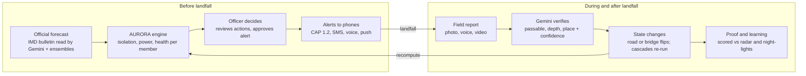
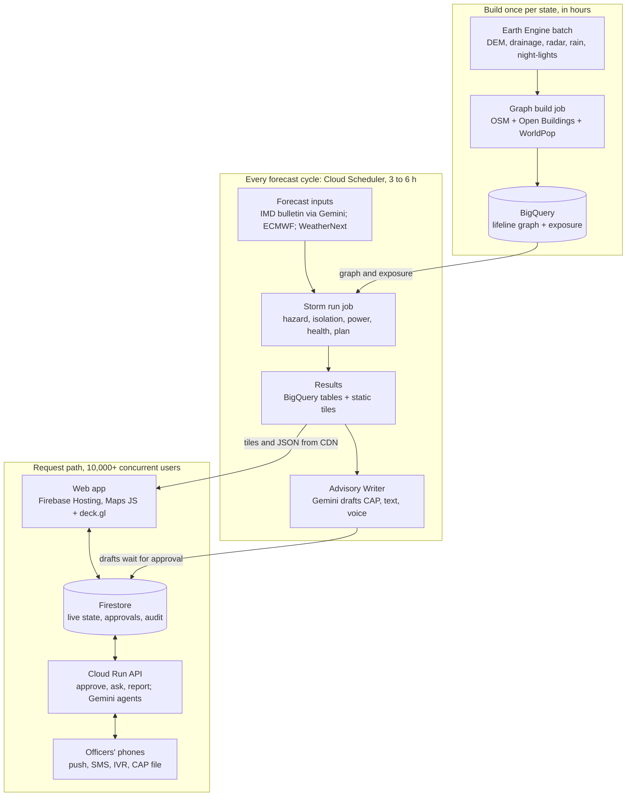

# Code for Communities 2.0 — Research & Product Blueprint

> **Snapshot notice (handoff, 28 Sep 2026).** This is an export of the team's Claude Doc, corrected by the handoff review. Where it differs from `CLAUDE.md` or the specific `docs/*.md` files, those win. In particular:
>
> - **Budget:** US$150 (not a credit).
> - **Serving:** Firebase Hosting's CDN, not a Cloud CDN load balancer.
> - **Graph:** rustworkx or NetworkX, not igraph.
> - **Parameters:** PRIOR in the slice, never calibrated on Montha.
> - **Scope:** the 30 Sep slice ships in-app push only. SMS/IVR, OR-Tools, Ask AURORA, the inland replay and the load test are Demo Day.
> - **Access:** asset-level results are public only for archived replays.
> - **Health:** expected deliveries = catchment population × the SRS crude birth rate. Dialysis shows "not mapped" unless a public list exists; the M6 row below is superseded.
> - **Gate G1:** as defined in `docs/BUILD_PLAN.md`, not the "advisory draft / health-only (C6)" wording below.
> - **Organiser questions:** send them now, before submission (`docs/HANDOFF.md`).


As of 27 Sep 2026

## Decision

**Build AURORA Lifeline for Track 05, the cyclone impact forecaster.** It turns an official cyclone forecast into three answers for district control rooms, days before landfall:

- who gets cut off from a hospital or shelter, how likely that is and when;
- who loses power;
- what to move where before the roads close.

Every answer comes with published proof of how well the model did on real past storms. The health-continuity view comes first (PHCs, CHCs and delivery points; dialysis centres if a public list exists), because the track names "medical shelters" and it is the clearest human stake.

An independent panel of four judges scored six finalists against the official weights, and all four picked this concept. It averaged 4.33 of 5, ahead of a Track 01 Demand Atlas at 4.01 and a Track 02 air-pollution concept at 3.83. It wins because:

- It is the only candidate that fits its track text clause for clause.
- It runs on real open data rather than synthetic data.
- It attacks a gap confirmed twice: no public Indian system found, and no competitor repository, computes probabilistic, time-resolved lifeline loss for facilities and settlements.

The main risk is also clear. A strong solo entry, ShadowCast, already ships wind, surge, road deadlines, a Gemini bulletin reader and CAP 1.2 drafts with officer approval, and publishes its skill scores. We win only by leading with what it and every other entry lack, and by cutting scope hard for 30 Sep.

**Two things to know before we build:**

- **Time.** Submissions close 30 Sep 2026 at 23:59 IST, about 2.5 days away, and the Top 20 is judged on what is live then. This blueprint describes the month-scale product you asked for, but the Roadmap splits it into a submission slice (by 30 Sep) and a Demo Day build (by 23 Oct).
- **Cost.** The hackathon build is estimated at US$50–150 in total, inside the owner's US$150 Google Cloud budget (approved 28 Sep; `docs/COSTS.md` is authoritative). The Cost approval section lists every service to switch on and asks for your sign-off first.

## Hackathon facts

Prototype submission closes on 30 Sep 2026, three days after this research started. You asked us to plan a month-scale product anyway. That fits the calendar: submit a strong, working core by 30 Sep, then keep building on a separate branch for the 23 Oct Virtual Demo Day and the in-person finale. Everything below was read from the [official event page](https://hack2skill.com/event/codeforcommunities2) on 27 Sep 2026 unless marked UNVERIFIED.

| Item | What the official page says |
| --- | --- |
| Name | Build with AI: Code for Communities — Second Edition |
| Organisers | A Google Cloud hackathon run with GDG India on Hack2Skill; questions go to the build-with-ai-india Google Group |
| Format | Hybrid: online build and evaluation, Virtual Demo Day, in-person demo day (date and venue TBA; overview says "in October") |
| Timeline | Launch 11 Aug 2026 · explainer session 14 Aug · registration, team formation and prototype submission until 30 Sep · evaluation 1–15 Oct · Top 20 shortlist 16 Oct · Virtual Demo Day 23 Oct |
| Submission cut-off time and time zone | 30 Sep 2026, 23:59 IST (18:29 UTC), per the event's own Hack2Skill data feed ([API](https://hack2skill.com/api/v1/event/codeforcommunities2/event-details)). No extension as of 27 Sep |
| Who can enter | Developers, AI/ML practitioners, product thinkers, freelancers, students, professionals and startups "across India". Working professionals are allowed; students are allowed, not required |
| Location restriction | India implied by "across India"; eligibility of non-residents is UNVERIFIED |
| Team size | 1–4; solo allowed ("if you're confident covering the full scope"); teams of up to 4 recommended |
| Fee | Free |
| Prizes | INR 10 lakh cash pool; split and per-track prizes not published (UNVERIFIED). The first edition paid INR 1 lakh / 75k / 50k per track ([first edition](https://hack2skill.com/event/codeforcommunities/)). This edition shows 16,256 registrations, about 2.3 times the first |
| Credits | Top teams receive Google Cloud credits; amounts UNVERIFIED. The page notes organisers will confirm AI Studio and Vertex AI credit details for registered teams |
| Mentorship | GDG Skilling Sprints and city workshops run by Google Developer Experts |
| After winning | Winning solutions "will be evaluated for pilot deployment within relevant ministries" through official government channels; terms shared before commitments |
| Build requirements | End-to-end flow for the track's core use case · mandatory Google AI (GenAI, predictive modelling or computer vision) · real or realistic data · designed to scale across states, not one city · multilingual or voice support where the track calls for it |
| Submission package | Public or access-granted GitHub repo · 3–5 minute demo video · 10–12 slide pitch deck (problem, solution, AI approach, who it serves, deployability, scaling across India) · 2–3 line description · live deployed link |
| Originality | Must be built during the hackathon; pre-existing projects ineligible "unless substantially extended" |
| Open source | Allowed if properly licensed; cite anything reused |
| Cross-border | Design for applicability across BRICS nations |
| Mandatory technology | Google AI in every submission. Track 05 names Google Earth Engine, real-time meteorological data and "Gemini 3.7 Flash" |
| Rules on AI-generated code, copyrighted material, datasets beyond "real or realistic", third-party APIs, public voting | The event page states none of these. The generic [Hack2Skill terms](https://hack2skill.com/legacy/tnc) may apply (UNVERIFIED; the event's own T&C field is empty). Those terms give the organiser a 6-month right of first refusal on any exclusive licence and a free right to publish submitted ideas, require a "sole author" originality warranty, and are silent on AI-generated code. No public voting is mentioned. They list team size as 2–6, which conflicts with the page's 1–4. The first edition's "rights stay with participants" line is gone from this edition |

The FAQ also says the architecture must scale beyond one city or state. It need not be localised for every state at prototype stage, "but judges will evaluate whether it could be."

## Tracks

The five official tracks differ most in how crowded they are. Agriculture and governance already have government AI tools live in 2026. Cyclone is the only track that names specific Google technology and asks for a hard geospatial engine that no public Indian system provides. Track texts are quoted from the [event page](https://hack2skill.com/event/codeforcommunities2).

| Track | What it asks for | Scale of the pain | Closest existing systems | What most teams will build | The real gap |
| --- | --- | --- | --- | --- | --- |
| 01 DPI & Governance | Aggregate multilingual citizen *development requests*, join them with demographic data, infrastructure indices and investment plans, surface demand hotspots, recommend projects to policymakers | About 2.6 lakh Gram Panchayats. A national 2026 study found 41.9% of citizens say Gram Sabhas lack visible outcomes ([PIB](https://www.pib.gov.in/PressReleasePage.aspx?PRID=2297557), [ThePrint](https://theprint.in/india/governance/low-awareness-work-commitments-lack-of-faith-are-keeping-citizens-away-from-gram-sabhas-govt-study/2974016/)). 25,000 eligible habitations still lack an all-weather road ([PIB](https://www.pib.gov.in/PressReleasePage.aspx?PRID=2158064)) | CPGRAMS with the Samadhan Didi voice assistant (22 languages, May 2026) ([PIB](https://static.pib.gov.in/WriteReadData/specificdocs/documents/2026/aug/doc202689948801.pdf)); SabhaSaar Gram Sabha minutes; Meri Panchayat; eGramSwaraj/GPDP; PAI 2.0; Mission Antyodaya; PM Gati Shakti | A WhatsApp complaint bot with a Gemini classifier and a heatmap, which duplicates Samadhan Didi | A citizen-demand layer that ranks projects by demand, measured gap and planned spend, for the new Viksit Gram Panchayat Plans ([PIB](https://www.pib.gov.in/PressReleasePage.aspx?PRID=2227541)) |
| 02 Clean Air & Climate | Fuse citizen photos and sensors with satellite and weather data, detect hidden hotspots, forecast spikes along corridors, alert authorities, share models across states | About 2 million deaths in 2023 ([SoGA 2025](https://www.healthdata.org/research-analysis/library/state-global-air-2025)). 64% of districts have no continuous monitor ([CSE](https://www.cseindia.org/india-s-fight-against-air-pollution-suffers-from-a-monitoring-lag-says-the-latest-state-of-india-s-environment-report-13028)) | CPCB NAQI; the Sameer app, which already routes geotagged photo complaints ([CPCB](https://cpcb.nic.in/air/Citizen_Guideliines_Air_Complaints.pdf)); IITM forecasts and Delhi decision support; CAQM fire counts; Google Air View+ in 150+ cities ([Google](https://blog.google/intl/en-in/company-news/using-googles-ai-and-local-ecosystem-to-generate-actionable-air-quality-insights-in-india-with-air-view/)) | An AQI dashboard with a health-tips chatbot, or a photo-to-AQI estimator | Source attribution to a responsible jurisdiction, forecast-triggered action outside Delhi-NCR, and fires that polar satellites miss: over 90% of large Punjab fires now burn after 3 pm ([Tribune](https://www.tribuneindia.com/news/delhi/satellites-miss-majority-of-stubble-fires-delhi-air-pollution-underestimated-report)) |
| 03 Smart Health & Supply Chain | Real-time medicine, bed and staff visibility across PHCs, demand forecasting, stock-out warnings, cross-district redistribution, shared models | 31,882 PHCs, 6,359 CHCs and 1.69 lakh sub-centres ([PIB](https://www.pib.gov.in/PressReleasePage.aspx?PRID=2053070)). A 2025 MoHFW review found the average PHC stocked 90 of 171 recommended medicines ([NHSRC](https://qps.nhsrcindia.org/sites/default/files/2025-05/DO-States%20-%20To%20Update%20Nomenclature%20of%20Facilities%20on%20DVDMS%20as%20Per%20IPHS.pdf)). Drugs are over 67% of out-of-pocket spending ([NHSRC](https://nhsrcindia.org/sites/default/files/2025-11/Final%20RFP%20for%203rd%20Party%20Evaluation%20on%20FDSI.pdf)) | DVDMS/e-Aushadhi, eVIN/U-WIN, HMIS, IHIP, ABDM facility registry; OpenLMIS, DHIS2 and mSupply abroad | A stock dashboard, an LSTM forecast and an ASHA chatbot | Expiry-aware rebalancing between districts, hazard-driven demand (heat, dengue), and capturing stock without typing. No public facility-level stock data exists, so the demo would need synthetic data |
| 04 Agricultural Intelligence | Localised agro-advisories, regenerative crop recommendations from satellite, soil and weather data, crop-disease diagnosis, shared models across states | 86% of holdings are small or marginal ([Agri Census](https://agcensus.da.gov.in/document/agcen1516/T1_ac_2015_16.pdf)); one extension worker per 1,162 holdings ([ICRISAT](https://oar.icrisat.org/11401/1/Agriculture-Extension-System-in-India-A-Meta-analysis.pdf)) | Bharat-VISTAAR AI advisory (Feb 2026) ([AIR](https://www.newsonair.gov.in/union-agriculture-minister-launches-farmers-digital-companion-bharat-vistaar)); Kisan e-Mitra; NPSS AI pest identification; Krishi-DSS; AgriStack; Google ALU/AMED; Plantix; Cropin Sage on Gemini | A PlantVillage disease classifier, a chatbot and an NDVI map. This is the most saturated track | Forecast-triggered contingency plans, cross-state pest nowcasting, satellite proof of regenerative practice |
| 05 Cyclone Impact Forecaster | Use Earth Engine, real-time weather data and Gemini 3.7 Flash to simulate surge and rainfall damage, map exposure of power grids, arterial roads and medical shelters, and dispatch advisories to municipal and disaster authorities | About 32 crore people vulnerable (NDMA 2008 estimate) along an 11,098 km coastline ([PIB](https://www.pib.gov.in/PressReleasePage.aspx?PRID=2198800)). Deaths have fallen, but lifelines have not: Fani left 3.5 million households without power on day 5 ([Outlook](https://www.outlookindia.com/national/india-news-five-days-after-cyclone-fani-hit-odisha-lakhs-still-without-electricity-towns-plunged-into-darkness-news-330010)); Montha (2025) damaged about 13,000 poles, 3,000 transformers and 14 bridges or culverts in Andhra Pradesh ([Deccan Chronicle](https://www.deccanchronicle.com/southern-states/andhra-pradesh/cyclone-montha-damages-13000-power-poles-3000-transformers-in-ap-1913863)). Last week's deep depression BOB 06 killed about 74 people in India, 56 of them far inland in Uttar Pradesh ([Al Jazeera](https://www.aljazeera.com/news/2026/9/27/floods-and-landslides-kill-at-least-56-people-in-india-12-in-nepal)) | IMD bulletins, whose damage table depends only on storm category ([SOP](https://rsmcnewdelhi.imd.gov.in/images/pdf/sop.pdf)); Web-DCRA admin-level loss atlas; INCOIS surge forecasts; NDMA Sachet alert delivery; Odisha SATARK; CDRI GIRI long-run risk; Google WeatherNext and Flood Hub | A cyclone-tracker map with a chatbot, an LSTM track predictor, mock SMS alerts | Asset-level, network-aware, time-phased consequences ("this hospital loses road access at T−14 h") with ensemble uncertainty, delivered as alerts in the national CAP format with human sign-off. No public Indian system doing this was found |

## Judging

Five published criteria with exact weights. 60% of the score (reach, deployability, impact) rewards national scale and a fast government pilot, not demo polish. No sub-criteria or rubric levels are published.

| Criterion | Weight | Official question | What it demands of our product |
| --- | --- | --- | --- |
| AI/Technical Execution | 25% | Is Google AI doing meaningful work? Does the prototype function end-to-end? | Gemini and Earth Engine must do the core computation, not decorate it. Real model calls with structured outputs, a real data pipeline, a deployed link that works when a judge clicks it |
| Problem-Solution Fit | 20% | Does it directly and specifically address the stated challenge? | Map every verb in the track text to a visible feature. Judges will read the track text next to our demo |
| Depth & Reach Across India | 20% | Can this realistically scale from one city or state to communities across India? | Multi-state data from day one, geography as configuration, Indian-language output, a clear path to every relevant district |
| Deployability & Scalability | 20% | Could this be piloted within a ministry or across states in weeks? | Consume the formats agencies already publish and emit the formats they already use. Show the pilot plan, the monthly cost and the load test |
| Impact Potential | 15% | Scale of benefit: how many people, across how many states, how meaningfully? | Count people and assets affected using real population data. Separate measured prototype results from future targets |

The page says the criteria are "ranked here by weight", but the listed order does not match the weights. We use the weights.

## Competitive landscape

Nobody, government or hackathon, gives the probability and timing of lifeline loss for each facility and settlement, or a capacity-aware shelter plan, or checks road-flooding predictions against satellite radar. Those three columns are where AURORA Lifeline has to win. Everything else in the table is already table stakes. Competitor capabilities come from public READMEs and live endpoints read on 28 Sep 2026; the AURORA column is the plan, not shipped work.

| Capability | IMD bulletins & impact-based forecasts | NDMA Web-DCRA | INCOIS surge system | Google WeatherNext / Flood Hub | ShadowCast (strongest T05 repo) | PRAVAAH (T05 repo) | AURORA Lifeline (plan) |
| --- | --- | --- | --- | --- | --- | --- | --- |
| Official track and intensity | Issues them | Consumes IMD | Consumes IMD | Own AI forecasts, labelled non-official | Consumes IMD PDFs via Gemini | Consumes | IMD bulletin is the default input, stamped on every output |
| Forecast uncertainty | Cone of uncertainty | Not documented | Not documented | multi-member cyclone ensemble (member count read from each file); 64-member weather ensemble | ECMWF ensemble replayed as issued | Not documented | ECMWF plus WeatherNext Cyclones members, shown as a labelled uncertainty envelope |
| Storm surge | Surge heights in text | Uses forecasts | ADCIRC model, \~55 cyclones warned | None | 1D setup model, compared with reported surge | Parametric | Screening model scaled to IMD/INCOIS heights; published model-vs-reported table |
| Rain flooding and inland reach | District rainfall warnings | Inland flooding layer | None | River and urban flash-flood forecasts | Rain totals only; east coast only | Heuristic | Height-above-drainage flooding calibrated to Sentinel-1, plus Flood Hub for inland districts |
| Impact unit | Storm category, generic damage table | District | Inundation extent | Grid cells | 7,281 named sites | H3 cells, Odisha | Each facility, road edge, bridge and settlement cluster |
| Road access | None | None found | None | None | Nearest arterial road's closing time; README says "no routing is attempted" | Deterministic reachability | **Probability of isolation and a P10–P90 time window per facility and settlement** |
| Shelter and hospital assignment | None | None | None | None | Roadmap item | None | **Capacity-aware assignment before roads close, with shortfall shown** |
| Power | None | Damage category | None | None | Substation outage probability, VIIRS-calibrated on Fani | None | **Population without power** from substation service areas, checked against VIIRS night-lights across several storms |
| Health continuity | None | None | None | None | Hospitals as sites | Hospital reachability | PHC, delivery-point and dialysis timelines with kit and DG-set needs |
| Proof | Verification reports | Not public | Published papers | Nature papers | Skill scores published, failures included | Claims one validation; admits no access ground truth | **Flooded-road skill vs Sentinel-1**, power skill vs VIIRS, failures published |
| Advisory delivery | Official issuer | Via NDMA | Official issuer | Web | CAP 1.2 download, 3 languages | Briefs | CAP 1.2 for Sachet upload, plus SMS, voice and push to officers' phones in up to 11 languages |
| After landfall | Bulletins stop | Not documented | None | None | None | None | Field photo or voice report changes an asset's state and all cascades recompute live |

Sources: [IMD SOP](https://rsmcnewdelhi.imd.gov.in/images/pdf/sop.pdf), [World Bank NCRMP review](https://documents1.worldbank.org/curated/en/099021825083513126/pdf/P144726-bfd1dbca-dfec-4100-893b-09d38239f293.pdf), [INCOIS](https://tsunami.incois.gov.in/TEWS/AboutStormSurge.jsp), [WeatherNext Cyclones](https://deepmind.google/blog/weathernext-ai-model-achieves-breakthrough-in-forecasting-cyclones/), [Flood Hub flash floods](https://research.google/blog/protecting-cities-with-ai-driven-flash-flood-forecasting/), [GitHub search of Track 05 repos](https://api.github.com/search/repositories?q=%22code+for+communities%22+cyclone+in:readme+created:%3E2026-08-10). ShadowCast's roadmap lists routing and shelter capacity, so these columns may narrow before judging.

## Our five ideas

AURORA is the only one of our ideas that fits its track almost clause for clause and meets a need that no public system in India covers. JanDrishti's intake and ticketing now duplicate a government product launched in May 2026. Its clustering and impact-graph engine is worth keeping, and it works best as AURORA's ground-truth loop.

| Idea | Track fit | Closest existing systems | What it doesn't beat | What survives | Verdict |
| --- | --- | --- | --- | --- | --- |
| 1 JanDrishti: multilingual grievance intake and routing | Weak (2/5). Track 01 asks for *development requests* joined to indices and investment plans, not complaint tickets | CPGRAMS with Samadhan Didi: voice in 22 languages via BHASHINI, automatic ministry and category routing ([PIB](https://static.pib.gov.in/WriteReadData/specificdocs/documents/2026/aug/doc202689948801.pdf)); state portals merged under One Nation–One Portal; Swachhata | Government already ships voice intake, routing and tracking at national scale | Multilingual voice and photo understanding as a component | Reject as a product |
| 2 JanDrishti Sentinel: evidence-backed problems and a Community Impact Graph | Partial (3.5/5). Strong on hotspots and prioritisation; built around failures rather than new development demand | Go Vocal (AI sensemaking of citizen input), Ushahidi, Polis ([DPGA](https://www.digitalpublicgoods.net/r/polis)); PM Gati Shakti has the layers but no citizen-demand layer ([NeGD](https://negd.gov.in/wp-content/uploads/2025/11/Ready-to-publish-PM-Gati-Shakti-NMP-Case-Study-Final-Draft-01-10-2025-1.pdf)) | Nothing public does multilingual clustering joined to Indian infrastructure indices | The clustering engine and the dependency graph (asset → school/PHC → people) | Keep the engine, re-use it |
| 3 Public Works Verification | Weak (2/5). Touches "measure impact" only | PMGSY OMMAS, geotagged quality-monitor photos, GPS on contractor machinery, NRSC satellite cross-checks ([PIB](https://www.pib.gov.in/PressReleasePage.aspx?PRID=2158064)); MGNREGA three-stage geotagging; World Bank GEMS | 10 m Sentinel-2 cannot reliably see narrow rural roads; government operational use of Earth Engine needs a commercial licence ([EE](https://earthengine.google.com/noncommercial/)); politically sensitive | Before/after satellite checks as evidence, never as a verdict | Reject as the headline |
| 4 AURORA: cyclone consequence engine | Very strong (5/5). Track 05 names surge simulation, rainfall damage pathways, exposure of power grids, arterial roads and medical shelters, and advisory dispatch | IMD bulletins with a category-only damage table ([SOP](https://rsmcnewdelhi.imd.gov.in/images/pdf/sop.pdf)); Web-DCRA admin-unit loss atlas; INCOIS ADCIRC surge; Odisha SATARK; CDRI GIRI (long-run, not event); GDACS and PDC (population, not Indian networks) | No public Indian system found that computes pre-landfall hospital or shelter access loss from road and bridge flooding, or population without power from substation exposure | The whole idea, plus a parametric-payout view on the same hazard engine | Strongest candidate |
| 5 JanDrishti + AURORA hybrid | Mixed. Spans two tracks, so Problem-Solution Fit (20%) would be judged against one track text and look diluted | As above | A two-track product reads as unfocused | Citizen and field-worker photos, voice and video, clustered and verified by Gemini, updating AURORA's asset states during and after landfall | Fold into AURORA; don't submit as a hybrid |

If we chose Track 01 anyway, the strongest re-framing is a **Demand Atlas**: a citizen-demand layer for the Viksit Gram Panchayat Plans that the VB-G RAM G Act introduced from 1 July 2026 ([PIB](https://www.pib.gov.in/PressReleasePage.aspx?PRID=2227541)), ranking projects by demand, measured gap and planned spend. It is scored against AURORA below.

## New ideas

Fourteen new candidates, at least two per track. None is a generic chatbot, dashboard or classifier. Each targets a gap that the existing systems in the Tracks section leave open. The strongest per track go into the scoring matrix.

| Idea | Track | One-line pitch | Killer feature | Google technology doing the work | Closest alternative | Main risk | 1-month feasibility |
| --- | --- | --- | --- | --- | --- | --- | --- |
| Demand Atlas | 01 | A citizen-demand layer for Viksit Gram Panchayat Plans and Gati Shakti | Demand × need × planned-spend quadrant per Gram Panchayat, which also surfaces "silent need" in villages that don't complain | Gemini audio and structured extraction, Gemini embeddings for cross-lingual clustering, BigQuery GIS joins over \~6.5 lakh villages | Meri Panchayat suggestions, Gati Shakti layers, Go Vocal | No real citizen data; ranking places is politically sensitive | High |
| Sabha-to-Plan | 01 | Gram Sabha minutes become a draft development plan with evidence and funding source per line | "Your draft skips 3 of your 5 worst PAI themes" | Gemini long-context over SabhaSaar minutes, retrieval over permitted works, BigQuery | SabhaSaar, eGramSwaraj | Weaker on the "national policymakers" clause | High |
| Outcome Lens | 01 | Did the sanctioned work fix the need that was raised? | Citizen "did it fix it?" follow-up combined with satellite before/after | Gemini vision on geotagged photos, Earth Engine change detection | OMMAS, GeoMGNREGA, social audits | Politically sensitive; overlaps scheme systems | Medium |
| PlumeTrace | 02 | A smoke photo becomes a satellite-corroborated case file routed to the responsible authority | Confirm one illegal kiln, then find look-alike unregistered sites with AlphaEarth similarity search | Gemini multimodal source classification, Earth Engine Sentinel-5P and AlphaEarth, WeatherNext winds | Sameer app routing, Green Delhi | Wrong attribution invites legal challenge | High |
| Airshed Early-Action Grid | 02 | GRAP-style, forecast-triggered action cards for NCAP cities outside Delhi-NCR | Joint cards for upwind and downwind states when one state's emissions drive another's spike | BigQuery AI.FORECAST (TimesFM), WeatherNext, Earth Engine, BigQuery data sharing | IITM forecasts, NCR-only GRAP | Forecast skill; nobody owns the actions | Medium-high |
| BurnLedger | 02 | Counts the stubble fires polar satellites miss | Village-level "fire count vs burned area" gap map | Earth Engine Sentinel-1/2 burn scars, AlphaEarth paddy masks, Gemini village briefs | CAQM and CREAMS fire counts, NASA FIRMS | Haze, cloud, political sensitivity | Medium |
| RxBalance | 03 | Expiry-aware medicine rebalancing across districts | "Days to stock-out vs days to expiry" frontier with a one-click transfer plan | BigQuery AI.FORECAST, Route Optimization API, Gemini transfer orders | DVDMS reorder alerts | Needs synthetic stock data; state transfer rules vary | High |
| ShockReady | 03 | Weather and outbreak forecasts become PHC-level medicine and staff kits | "Heatwave in 9 days" produces an ORS, IV-fluid and duty plan per PHC | WeatherNext ensembles, BigQuery, TimesFM, Gemini memos | Qualitative heat-health advisories | Demand elasticities unvalidated | Medium-high |
| ShelfLens | 03 | Photo and voice stock capture for PHC pharmacies | 30 seconds from a stock-register photo to a DVDMS-ready entry | Gemini multimodal, Gemma 3n offline, Android FHIR SDK | Manual DVDMS entry, barcode systems | Misread medicine names | High |
| MonsoonPlaybook | 04 | District contingency plans switch on at field level when forecasts turn | "Plan B already in your language" before the dry spell | Gemini converts contingency-plan PDFs to rules, WeatherNext, Earth Engine crop masks, Gemini TTS | CRIDA static plans, district bulletins | False alarms; advice liability | High |
| PestPulse | 04 | Cross-state pest and disease outbreak nowcasting | "Fall armyworm front moving 40 km a week" map | Gemini diagnosis, BigQuery data sharing across states, Earth Engine | NPSS, Plantix | Too few reports at launch | Medium |
| RegenProof | 04 | Satellite proof that a farmer adopted a regenerative practice, as scheme-eligibility evidence | A per-field verified-practice passport | Earth Engine time series, AlphaEarth, Gemini evidence packs | Manual verification, carbon start-ups | Classifier accuracy and ground truth | Medium |
| PayoutCast | 05 | Probability of a parametric payout, by district or policy, 72 hours before landfall | Gemini reads a contract term sheet and turns its trigger into code, then runs it over the forecast ensemble | Gemini document understanding, WeatherNext Cyclones ensemble, Earth Engine rainfall | Nagaland and Cuddalore parametric pilots | Small event sample; insurance regulation | Medium-high |
| EvacFlow | 05 | Village-to-shelter evacuation plan that respects capacity and road-closure times | "This shelter overflows at T−9 h; this one is cut off at T−6 h" | Earth Engine flood layers, OSM network analysis, Gemini CAP messages | Odisha SATARK, Bangladesh preparedness programme | Shelter condition data; human behaviour | High |

Four of these, EvacFlow, PayoutCast, ShockReady and Outcome Lens's verification loop, can run on the same hazard-and-impact engine as AURORA. That matters for Depth & Reach and for the post-hackathon roadmap.

## Scoring

AURORA Lifeline scores highest on the official weights (4.33 of 5) and was every judge's first choice. It also has the lowest one-month feasibility score. The plan below is built around that weakness.

**Method.** Four independent judge agents each scored the six finalists from 1 to 5 on every criterion, working from the same evidence brief. Their lenses were a Google Cloud/DeepMind engineer, a government deployer, a skeptical domain scientist and a hackathon strategist. The weighted score uses the official weights; the last three columns are tie-breakers outside the rubric. Two red-team agents then attacked the top two candidates. JanDrishti intake (Idea 1) and Works Verification (Idea 3) were ruled out earlier, in Our five ideas.

| Candidate | Track | Fit (20%) | AI/Tech (25%) | Reach (20%) | Deploy (20%) | Impact (15%) | **Weighted /5** | Low saturation | 1-month feasibility | Data realism | Judges' picks |
| --- | --- | --- | --- | --- | --- | --- | --- | --- | --- | --- | --- |
| C1 AURORA Lifeline | 05 | 5.0 | 4.0 | 4.5 | 3.75 | 4.5 | **4.33** | 2.6 | 2.5 | 4.5 | Winner for all 4 |
| C2 Demand Atlas | 01 | 4.5 | 3.6 | 4.9 | 3.1 | 4.0 | **4.01** | 2.3 | 4.0 | 2.1 | Runner-up for 2 |
| C3 PlumeTrace + Airshed Grid | 02 | 4.1 | 4.0 | 4.0 | 3.0 | 4.0 | **3.83** | 3.1 | 3.4 | 4.1 | Runner-up for 1 |
| C6 Health-Lifeline Continuity | 05 | 4.0 | 3.6 | 3.9 | 3.6 | 3.5 | **3.73** | 3.5 | 3.9 | 3.3 | Runner-up for 1; folded into C1 |
| C4 RxBalance + ShelfLens + ShockReady | 03 | 4.4 | 3.6 | 3.8 | 2.6 | 4.1 | **3.68** | 2.5 | 3.9 | 1.6 | — |
| C5 MonsoonPlaybook + PestPulse | 04 | 3.5 | 3.5 | 4.1 | 2.9 | 3.9 | **3.56** | 1.5 | 3.6 | 3.6 | — |

What would change the pick, according to the judges:

- **Switch to C6 inside Track 05** if a working, backtested access-loss timeline on one real storm cannot be shown by 30 Sep.
- **C2 or C3 become competitive** if ShadowCast or another entry ships probabilistic facility isolation with validation first, or if the organisers name MoPR as the pilot ministry.
- **C4 moves up** if a state shares real drug-stock data.

The red team rated both C1 and C2 "beatable with changes". C2's crowded idea space was already taken by a live competitor (CIVOS) with the same demand-by-deficit quadrant. C1's gaps are verified.

## Selected concept: AURORA Lifeline

**Pitch:** "IMD tells you the storm. Web-DCRA tells you the district's risk. AURORA Lifeline tells you which PHC is cut off, how likely, when, and what to move there now."

**Problem statement.** District control rooms get official forecasts in the 72 hours before a cyclone lands: the track, the intensity, and colour-coded district warnings. No system tells them which roads, bridges, substations, hospitals, PHCs and shelters will fail, how likely that is and when. So decisions on where to stage earthmovers, repair crews, generators, medical kits and evacuations rest on category tables and experience.

Deaths have fallen from about 9,887 in 1999 to zero in Odisha during Dana (2024). Lifeline losses have not:

- Fani left 3.5 million households without power on day 5.
- Montha damaged about 13,000 poles and 14 bridges or culverts in Andhra Pradesh.
- Last week a weak depression killed 56 people far inland in Uttar Pradesh.

**Users.**

- **Primary:** District Emergency Operations Centre officers and District Collectors in cyclone-prone and rain-pathway districts; state disaster management authority (SDMA) control rooms.
- **Secondary:** district health officers, power-distribution and public-works control rooms, and field responders (block officials, Aapda Mitra volunteers, ASHA supervisors, linemen).
- **Later:** state finance departments and insurers, for an indicative parametric view.

**Vision.** Before every landfall, each cyclone-prone and rain-pathway district in India sees a ranked, time-stamped list of lifelines at risk and the actions that protect the most people. Every outcome then feeds back to improve the next forecast of consequences. The same engine extends to river floods, heatwaves and other BRICS coasts.

| Question | Answer |
| --- | --- |
| Why this problem? | It is the unsolved half of cyclone management. Early warning and evacuation have largely solved deaths; road, power and health-access losses are what now hurt most people for longest |
| Why now? | The post-monsoon cyclone season runs October to December, so a pilot would land in season. Google published its WeatherNext cyclone ensemble in *Nature* in August 2026. Gemini 3.7 Flash can read IMD's PDF bulletins. India chairs BRICS in 2026 and hosted its disaster-risk ministerial in July |
| Why AI? | Ensembles turn one forecast into probabilities. Gemini turns unstructured official inputs (bulletin PDFs, situation reports, field photos and voice notes) into machine-usable facts and writes advisories in Indian languages. A deterministic engine produces every number |
| Why Google? | The track names Earth Engine and Gemini 3.7 Flash. WeatherNext Cyclones and Flood Hub are Google's own hazard AI; Earth Engine holds Sentinel-1, Open Buildings and VIIRS night-lights; BigQuery, Cloud Run and Firebase (Hosting CDN) carry national scale. See the technology map |
| Why hasn't the market solved it? | Government tools stop at district level or storm category. Commercial catastrophe models (e.g. RMSI, Fathom) estimate long-run insured loss and are proprietary. Doing it per asset means fusing more than six open datasets with ensembles and network analysis, which only became practical recently |
| Why would officials use it? | It answers the control room's actual questions: which road closes when, where to stage machines, which PHC needs a generator. Answers arrive in the officer's language, on their phone, with the IMD bulletin number stamped as the source |
| Why would government care? | It extends Odisha's zero-casualty model to zero isolation and faster restoration. It emits CAP 1.2 for Sachet, is packaged as a Digital Public Good, and runs on Google Cloud or a state data centre at low cost per state per season |
| Why is it feasible? | Every input is open. The heavy computation is precomputed. The methods are established: Holland wind profiles, height-above-drainage flooding, Sentinel-1 change detection, graph reachability |
| Why does it scale? | Geography is configuration: a state's exposure graph builds in hours, and results are served as static files from a CDN, so 10,000 viewers cost about the same as 10. Storm basins come from the global IBTrACS archive, which makes other BRICS coasts a data task |
| Why will the demo land? | A real storm (Montha) replayed as forecast. PHCs go grey on a time slider, a Telugu voice advisory is approved on a phone, a field photo reopens a road live, and a proof page shows hits and misses |
| Why us? | Your JanDrishti Sentinel "Community Impact Graph" (road → school/PHC → people) is exactly the dependency engine this needs; AURORA gives it the hazard front end. Team skills are yours to judge; the build plan assumes a strong four-person team using AI coding tools |

**Biggest weakness and mitigation.** We face a strong, published competitor with 2.5 days left, and the scientific credibility of surge, flooding and fragility is open to challenge. The mitigation:

- Lead with the verified gaps: probabilistic isolation, capacity-aware shelter assignment, population without power, radar-scored roads.
- Cut the 30 Sep scope to one working storm replay.
- Keep IMD and INCOIS as the authority.
- Label surge as a screening model.
- Publish per-storm skill scores, failures included.
- Show a map-completeness badge per district.

## Features

The 30 Sep submission slice needs 9 must-haves plus a minimal field-report loop, all working end to end on one storm (Montha, 2025) across Odisha and Andhra Pradesh. Everything else lands by Demo Day or in production. In the "Ships" column, **Slice** means it is in the 30 Sep submission; **Demo Day** means it is built by 23 Oct.

### Must have

| Feature | User story | How it works | Google services | Complexity | Ships |
| --- | --- | --- | --- | --- | --- |
| M1 Forecast intake | As a control-room officer, I want the latest official forecast and its uncertainty loaded without typing, so the model runs on the storm IMD is describing | A scheduler polls IMD's bulletin page. Gemini reads the PDF and track graphic into a fixed schema (positions, times, intensity, surge heights, bulletin number). This is checked against the ECMWF and WeatherNext ensemble consensus, and a large mismatch goes to a human | Gemini 3.7 Flash (structured output), Cloud Scheduler, Cloud Run jobs, BigQuery | Medium | Slice |
| M2 Hazard engine | As an analyst, I want wind, surge and rain flooding per ensemble member so I can see the spread, not one guess | Holland wind profile with land decay, with intensity corrected to IMD's forecast. Surge is a screening model scaled to IMD/INCOIS heights and attenuated inland. Rain flooding uses the height above the nearest drainage with PRIOR thresholds (calibration on past storms, never Montha, is Demo Day work) | Earth Engine (DEM, drainage heights, surface water, radar, rainfall; precomputed), Cloud Run jobs | High | Slice |
| M3 Lifeline graph | As an SDMA, I want every road, bridge, facility, settlement and substation in one connected model | OSM roads with bridges and culverts as explicit edges. Hospitals, PHCs, CHCs and shelters from OSM and healthsites. Settlements clustered from Open Buildings and WorldPop. Substation service areas. Each district gets a map-completeness badge | Earth Engine (Open Buildings, WorldPop), BigQuery GIS | High | Slice |
| M4 Isolation forecast (the hero) | As a Collector, I want to know which facilities and settlements will be cut off, how likely and when | For each ensemble member, compute when each edge closes. A widest-path search then gives the probability of isolation, a P10–P90 time window and the population cut off from its nearest working hospital | Cloud Run jobs, BigQuery, Cloud Storage + CDN | High | Slice |
| M5 Population without power | As a power-distribution control room, I want to know how many people lose supply and where | Substation exposure through prior fragility curves, then service-area population. The share of substations actually mapped is always shown | BigQuery GIS, Earth Engine | Medium | Slice (VIIRS validation by Demo Day) |
| M6 Health continuity | As a district health officer, I want the PHCs, CHCs and delivery points (dialysis centres on Demo Day, if a public list exists) that will lose road or power, and what each needs | Facility timelines from M4 and M5. Expected deliveries in the window are estimated from WorldPop births and the SRS birth rate (no patient data). Dialysis centres come from the national programme's list | BigQuery | Medium | Slice |
| M7 Actions and advisories with approval | As an officer, I want ranked actions and a ready advisory in my language that I approve before it goes anywhere | Actions are ranked deterministically by people protected. Gemini drafts CAP 1.2 and plain messages with the numbers injected into templates, never generated. A back-translation check follows. The officer approves, the CAP is validated against the schema, and every step is logged | Gemini 3.7 Flash, 3.5 Flash-Lite, 3.8 Flash-Lite TTS, Firestore, Firebase Auth | Medium | Slice (English, Hindi, Telugu, Odia) |
| M8 Replay and proof | As a judge or SDMA, I want to see how the model did on a real storm, misses included | Montha replayed from 72 hours out using forecasts as issued. Predicted flooded roads are scored against Sentinel-1 flooding (hit rate and critical success index) and misses are published | Earth Engine (Sentinel-1), BigQuery | Medium | Slice |
| M9 Command map | As any user, I want one fast map that works on a district laptop | Google Maps basemap with deck.gl layers streamed from the CDN, a time slider, and a no-login judge mode | Maps JavaScript API, Firebase Hosting CDN | Medium | Slice |

### Should have

| Feature | User story | How it works | Google services | Complexity | Ships |
| --- | --- | --- | --- | --- | --- |
| S1 Field-report loop | As a block official, I want to send a photo or voice note and have the map update | The report arrives from the field web app or WhatsApp. Gemini checks location and time consistency and estimates whether the road is passable, water depth and damage state, with a confidence score. Low confidence goes to an officer. The asset state updates, affected cascades recompute in under 10 s, and every viewer sees the change live | Gemini 3.7 Flash (image, audio, video), gemini-embedding-2 (duplicates), Cloud Storage, Eventarc, Firestore | High | Slice (one report), Demo Day (full) |
| S2 Pre-positioning optimiser | As a Collector, I want to know where to stage earthmovers, crews, generators and kits, and which shelter each settlement should use | Google OR-Tools solves assignment under shelter capacity and road-closure deadlines and reports any shortfall | OR-Tools on Cloud Run | High | Demo Day (a greedy version in the slice if time allows) |
| S3 Phone delivery | As an officer, I want approved alerts on my phone, not in a web page I might miss | Push to the web app, SMS, and an IVR voice note through a telephony test account. WhatsApp follows once templates are approved | Firebase Cloud Messaging, Gemini TTS | Medium | Demo Day |
| S4 Ask AURORA | As an officer, I want to ask "which PHCs lose access before landfall in over half the members?" and get a cited answer | An Agent Development Kit agent with read-only tools over the BigQuery views and engine API. Structured answers cite the rows they came from | Gemini 3.7 Flash, ADK, Cloud Run | Medium | Demo Day |
| S5 Inland rain pathway | As an inland district, I want warnings when a weakening system floods my area | A BOB 06 (Sep 2026) replay into Uttar Pradesh, using Flood Hub river and flash-flood forecasts | Flood Hub API, Earth Engine | Medium | Demo Day |
| S6 Power validation | As a judge, I want proof the power estimate works | VIIRS night-light loss per service area across Fani, Hudhud, Amphan, Dana and Montha, scored leave-one-storm-out | Earth Engine (VIIRS Black Marble), BigQuery | Medium | Demo Day |
| S7 More states | As NDMA, I want every coastal state | Tamil Nadu (Michaung, Fengal), West Bengal (Amphan, Remal) and Gujarat (Biparjoy). Any new storm runs with one click in under 10 minutes | Cloud Run jobs, Earth Engine batch | Medium | Demo Day |

### Wow moments

- **Lifeline Countdown** (Slice): facilities fade as their last road floods, with probability halos and time windows.
- **Road reopened live** (Slice): a field photo turns a bridge back to passable, and the PHC behind it goes green for every connected viewer.
- **Voice advisory** (Slice): the approved Telugu or Odia alert plays from a phone.
- **Proof page** (Slice): hits and misses against radar, shown in the same view.
- **Live shadow forecast** (Demo Day, if a storm forms): forecast hashes are committed publicly before landfall; the forecasts are published and verified after landfall.
- **BRICS replay** (Demo Day): Cyclone Remal over Bangladesh and West Bengal, with configuration changes only.

### Production

- Government single sign-on and role-based access per state (Identity Platform with SAML or OIDC).
- India data residency (Mumbai/Delhi regions), VPC Service Controls, customer-managed keys.
- An Earth Engine commercial plan, or a direct Copernicus/NASA pipeline.
- Data agreements for SDMA shelter capacities, power-distribution substation and feeder maps, public-works bridge inventories, NHM facility lists, an IMD API account and INCOIS surge feeds.
- Sachet publishing through the SDMA's authorised originator.
- Offline field app with Gemma 4 on-device triage, plus SMS and IVR fallback.
- Seasonal recalibration and a live skill dashboard.
- Service-level objectives, on-call during events, multi-region disaster recovery.
- WCAG 2.2 AA accessibility and all 22 scheduled languages.
- An immutable audit trail with retention policies.

### Future (roadmap, not built now)

- Multi-hazard use of the same engine: river floods in Assam and Bihar, heatwave health continuity, urban flooding.
- A hardening planner using long-run synthetic tracks, to decide which towers and bridges to strengthen, with CDRI.
- A restoration crew scheduler.
- An indicative parametric-trigger view for state finance departments and insurers.
- Power-distribution outage feeds.
- BRICS/APAC deployments.
- A year-round JanDrishti civic layer, where citizens report weak culverts and blocked drains into the same graph between storms.

## Roles and journeys

Six roles, one loop. The control-room officer is the decision maker, and nothing reaches the public or the field without their approval. Field reports after landfall are the only input that can change an asset's state, and a low-confidence report needs an officer's confirmation.



The top row runs before landfall; the bottom row runs during and after it. A verified field report re-enters the engine, so the officer's view stays current.

| Role | Can do | Journey |
| --- | --- | --- |
| Control-room officer (district emergency operations centre, Collector) | See the district's isolation, power and health timelines and ranked actions; edit and approve advisories; confirm low-confidence field reports | Push alert about a new IMD bulletin → open district view → scrub the Lifeline Countdown → review action cards → edit and approve the advisory → watch field reports → confirm a road reopening → post-event summary |
| SDMA analyst (state control room) | Everything above for all districts; run what-if scenarios; set thresholds; view the proof page | New depression → check Gemini's bulletin reading against IMD → compare ensemble spread → brief districts → season-end calibration review |
| Line-department officer (health, power, public works) | A role-filtered view (PHCs and delivery points; substations and service areas; roads and bridges); acknowledge and close tasks | Phone alert → open role view → assign a crew, generator or kit → mark done → see the risk drop on the map |
| Field responder (block official, Aapda Mitra volunteer, lineman, ASHA supervisor) | Receive tasks; send geotagged photo, voice or video reports, queued offline | Task on phone → travel → report ("bridge passable, water 20 cm") → get confirmation once it is verified |
| System administrator (state IT or NIC) | Onboard a state (geography, data layers, departments), manage users and roles, keys, quotas and audit exports | Add state config → run the exposure-graph build job → check the completeness badges → invite officers |
| Read-only viewer (judges, NDMA; the public later) | Replay and proof pages, with no personal data and no unapproved predictions | Open the link → play the Montha replay → read the proof page |

## AI architecture

Five small Gemini agents handle the unstructured work: bulletins, field evidence, language, questions and validation. A deterministic engine produces every number that reaches an officer. Gemini never outputs a probability, count or time; it reads, verifies, explains and writes around numbers it is given.

### Agents

| Agent | Input | Tools | Model | Output | Guardrails | If it fails | Human approval |
| --- | --- | --- | --- | --- | --- | --- | --- |
| Bulletin Reader | IMD bulletin PDF and track graphic | None (pure extraction) | gemini-3.7-flash, low thinking, JSON schema | Bulletin number, issue time, forecast positions with intensity, surge heights by district, rainfall warnings | Schema validation. Physical checks (fix-to-fix speed, basin bounds). Distance from the ensemble consensus flagged above a threshold. The document is data, not instructions | Text-layer parser, then manual entry by an analyst | Analyst confirms any parse that fails a check |
| Field Verifier | Photo, voice or video; claimed place and time; nearby assets from the graph | Nearest-asset lookup; metadata extraction (deterministic) | gemini-3.7-flash multimodal (audio read directly) | Asset ID, passable yes/no/unknown, water-depth band, damage state, evidence notes, confidence | Metadata vs claimed-location check. Duplicates caught with gemini-embedding-2 plus image hashing. Cannot create assets; only proposes a state | Report queued for an officer | Officer confirms any change below the confidence threshold, and every bridge reopening |
| Advisory Writer | Engine facts as structured data, template, IMD glossary, target language | None | gemini-3.7-flash to draft; gemini-3.5-flash-lite to back-translate; gemini-3.8-flash-lite-tts for voice | CAP 1.2 fields, SMS text, voice script | Numbers go into placeholders, and a post-check confirms every number matches the engine. Validated against the CAP 1.2 schema. No evacuation language unless the officer ticks it. A back-translation check follows | English template plus a human translator | Always, before any dispatch |
| Ask AURORA | An officer's question | Read-only: parameterised view queries, facility timeline, district summary, member comparison, action explanation | gemini-3.7-flash with Agent Development Kit | Answer citing the rows it used | No free-form SQL; tools are read-only; out-of-scope questions are refused; numbers come only from tool results | Opens the matching table view | None (information only) |
| Sitrep Extractor (batch) | SDMA situation-report PDFs from past storms | None | gemini-3.5-flash-lite via the Batch API | Closed roads and bridges with place and date, for the validation set | A 10% manual spot-check, with agreement reported | Manual extraction for that storm | Analyst signs off the validation set |

The deterministic core is not an agent and uses no LLM: wind, surge and flood hazard, fragility, the lifeline graph, reachability, power and health estimates, the OR-Tools optimiser, and CAP assembly.

### Model routing

| Job | Model | Why | Price per 1M tokens (in / out) |
| --- | --- | --- | --- |
| Bulletins, field photos and video, advisories, agent reasoning | gemini-3.7-flash | Named in the track; multimodal, structured output, function calling | $0.75 / $3.75 until 31 Dec 2026, then $1.50 / $7.50 |
| Bulk extraction and back-translation | gemini-3.5-flash-lite | Cheapest capable model for high-volume text | $0.30 / $2.50 (half price in batch) |
| Voice notes in and out | Gemini audio input; gemini-3.8-flash-lite-tts | Chirp 3 is generally available only for Hindi and runs only in US/EU; Gemini TTS covers Odia, Telugu, Bengali and Tamil | About $0.009 per minute of generated audio |
| Duplicate field reports | gemini-embedding-2 | Works across 100+ languages and images | $0.20 text |
| Backtests and sitrep extraction | Batch API | 50% off, 24-hour turnaround | Half the list price |
| Final ministry report (optional) | gemini-3.1-pro-preview | Only where long-form reasoning matters; Preview with no free tier | $2 / $12 |

Prices are from [Gemini API pricing](https://ai.google.dev/gemini-api/docs/pricing) and the [3.7 Flash model page](https://ai.google.dev/gemini-api/docs/models/gemini-3.7-flash). In production we will call Gemini through Gemini Enterprise Agent Platform (formerly Vertex AI), not the AI Studio free or Tier 1 plans. Tier 1 caps spend at $10 per 10 minutes, which would break a live demo ([billing](https://ai.google.dev/gemini-api/docs/billing)).

### Human in the loop

| AI acts automatically | AI recommends | Human must approve | Never allowed |
| --- | --- | --- | --- |
| Read and check forecasts; compute hazards and impacts; refresh maps; draft advisories; group duplicate reports; compute validation scores | Action cards; shelter assignments; pre-positioning plans; what-if results; indicative parametric probabilities | Sending any advisory; changing an asset's state on a low-confidence report; reopening a bridge; publishing anything public; accepting a bulletin reading that failed a check | Issuing official warnings or evacuation orders in the tool's own name; overriding IMD or INCOIS values; decisions about individual patients; allocating funds or triggering insurance payouts |

### Hallucination controls

- **Structured outputs everywhere,** validated against JSON Schema; anything that fails is rejected, never repaired silently.
- **Numbers only from the engine.** They go into templates, and a post-check compares every number in the text with the engine's facts.
- **A provenance stamp on every output:** IMD bulletin number, ensemble run, data versions, model version.
- **Uncertainty always shown** as a probability and a P10–P90 window, never a single hour.
- **Rule checks** on physical plausibility, CAP schema and allowed vocabulary.
- **Published evaluation sets:**
  - bulletin-reading accuracy on 30 past IMD bulletins;
  - field-verifier confusion matrix on labelled public post-storm images;
  - back-translation agreement by language.
- **Prompt-injection defence:** bulletins, reports and PDFs are treated as untrusted data. Extraction agents get no tools, and the query agent gets only read-only, parameterised tools.

## Google technology map

Google technology carries the product end to end: Google's cyclone AI supplies the uncertainty, Earth Engine the satellite evidence, Gemini the reading, checking and writing, and BigQuery with Cloud Run, CDN and Firebase the national scale. It is not a chatbot bolted onto a dashboard. Several Google products are deliberately left out; they are listed under the table.

| Capability | Google technology | Why this technology | Alternative | Why Google wins |
| --- | --- | --- | --- | --- |
| Read IMD bulletins, field photos, video and voice; write advisories | Gemini 3.7 Flash via Gemini Enterprise Agent Platform | One model handles PDF graphics, photos, audio, structured output and function calling across Indian languages; the track names it | OCR plus separate vision, speech and translation models | One integration instead of four, with schema-validated output |
| Forecast uncertainty | WeatherNext Cyclones (Weather Lab tracks) and WeatherNext 3 in Earth Engine and BigQuery ([guide](https://developers.google.com/weathernext/guides/weatherlab)) | Google's AI cyclone ensemble (published in *Nature* in 2026) gives a multi-member ensemble for probabilities (member count read from each file) | ECMWF open ensemble, which we also use | A larger ensemble, loaded straight into Earth Engine and BigQuery; historical data is CC BY 4.0 |
| Satellite and terrain evidence | Google Earth Engine (batch precompute) | Sentinel-1 radar, Copernicus DEM, height above drainage, surface water, IMERG rain, VIIRS night-lights and Open Buildings in one catalogue, computed server-side | Download from Copernicus and NASA and process on VMs | Days of data engineering become hours; results export straight to BigQuery and Cloud Storage |
| Settlements where maps are thin | Google Open Buildings v3 and 2.5D Temporal | Building footprints with confidence and heights across India, CC BY 4.0 | Microsoft footprints | Confidence scores and heights, native in Earth Engine |
| Inland flooding | Flood Hub API ([blog](https://research.google/blog/protecting-cities-with-ai-driven-flash-flood-forecasting/)) | River and urban flash-flood forecasts up to 24 h ahead | No open equivalent at this scale | The only open operational flood forecast covering India at scale |
| National exposure analytics and results | BigQuery with GIS functions | Spatial joins across all coastal states; the results warehouse for replays and validation | PostGIS on a VM | Serverless at national scale, 1 TiB of queries a month free |
| Pipelines and APIs | Cloud Run services and jobs, Pub/Sub, Cloud Scheduler, Eventarc | Per-storm batch jobs and a thin API that autoscales | VMs or Kubernetes | Scales to zero between storms and up to 1,000 concurrent requests per instance during them |
| Serving 10,000+ viewers | Firebase Hosting (built-in CDN), with Cloud Storage as the source | Tiles and scenario JSON as immutable static files | Custom tile servers | Cost per viewer is flat, about $0.09 per GiB of APAC egress |
| Live state, approvals, push | Firestore, Firebase Auth, App Check, Cloud Messaging | Real-time listeners for approvals and field reports; push alerts to officers | Hosted Postgres plus a websocket service | Real-time fan-out and offline sync built in |
| Map | Maps JavaScript API with a deck.gl overlay | The basemap officials already know; India pricing gives 70,000 free map loads a month ([pricing](https://developers.google.com/maps/billing-and-pricing/pricing-india)) | MapLibre with self-hosted OSM tiles | Familiar, fast, cheap in India. Check that boundary rendering meets Survey of India rules |
| Question-answering agent | Agent Development Kit (open source, Apache-2.0) | Tool-using agent with built-in evaluation, deployable on Cloud Run | LangChain | First-party integration with Gemini and Google Cloud |
| Pre-positioning and shelter assignment | Google OR-Tools (open source) | CP-SAT and assignment solvers for capacity and deadline constraints | PuLP or commercial solvers | Fast, free, well-proven at this problem size |
| Voice | Gemini audio input; gemini-3.8-flash-lite-tts | Understands and speaks Odia, Telugu, Bengali and Tamil | Chirp 3 speech-to-text (Preview except Hindi, US/EU only); Chirp 3 HD voices (no Odia) | Covers the coastal languages from one API |
| Offline field triage (production) | Gemma 4 E4B on device | Works where networks are down after landfall | None | Apache-2.0 licence; runs on phones |
| Operations and cost safety | Secret Manager, Cloud Logging and Monitoring, budgets and spend caps, IAM | Keys out of code, observability, spend limits on Gemini and Cloud Run | — | Native to the same project |

**Deliberately not used, and why:**

- **Dialogflow / Conversational Agents:** costs more than Gemini Live or a transcribe-reason-speak chain and adds nothing here.
- **Vertex AI Vision:** shuts down on 30 Sep 2026 ([docs](https://docs.cloud.google.com/vision-ai/docs)).
- **AutoML:** Gemini and the physics engine cover every need; there is no labelled dataset to train on.
- **Translation API:** Gemini plus back-translation and a glossary is enough. We may add it later for glossary-locked terms.
- **Maps Routes API:** it cannot avoid arbitrary closed roads ([docs](https://developers.google.com/maps/documentation/routes/route-modifiers)); at most it can calibrate baseline travel times.
- **Maps Weather API:** it has no public alerts for India.

## Architecture

The hackathon build and the production system share one design: precompute everything slow, serve results as static files, and keep Gemini and Earth Engine out of the request path. That is how 10,000 concurrent users get the same experience as ten.



The build and forecast layers do all the heavy work. When a verified field report changes an asset, the Cloud Run API triggers a recompute of only the affected part of the graph.

**Why 10,000 concurrent users holds** (estimates from [Cloud Run](https://docs.cloud.google.com/run/docs/about-concurrency), [Cloud CDN](https://cloud.google.com/cdn/pricing) and [Firestore](https://cloud.google.com/firestore/pricing) pricing; to be proven with a load test before we claim it):

- 10,000 users each sending one API request every 15 seconds is about 670 requests a second. At 100 ms each, about 67 are in flight, which 1–2 Cloud Run instances handle at concurrency 80.
- Map layers are about 5 MB per session, so a 10,000-user wave is about 50 GB of CDN egress, roughly US$4.50.
- Live state is one small Firestore document per district. One update read by 10,000 listeners costs about US$0.003.
- Earth Engine allows only 40 concurrent interactive requests per project, so it only ever runs in batch.

| Layer | Version A: hackathon MVP (30 Sep slice, deepened by Demo Day) | Version B: production (an SDMA deploys tomorrow) |
| --- | --- | --- |
| Frontend | Next.js (TypeScript) PWA on Firebase Hosting; Maps JavaScript API with deck.gl; no-login judge mode | Same app, WCAG 2.2 AA, 22 languages, offline field mode with Gemma 4 on device |
| Auth and access | Firebase Auth (email link) for officers; roles held as custom claims | Identity Platform with state single sign-on (SAML/OIDC), per-state tenants, MFA for approvers |
| API | One Cloud Run service (FastAPI), min-instances=1 during judging, rate limits, App Check | API Gateway or a load balancer with Cloud Armor; separate services per domain; SLOs |
| Pipelines | Cloud Scheduler → Pub/Sub → Cloud Run jobs (graph build, storm run, recompute) | Same, plus Workflows for retries, per-state queues and an archiver that snapshots every official feed |
| AI | Gemini 3.7 Flash and 3.5 Flash-Lite via Agent Platform; ADK agent; cached outputs for demo storms | Same, plus quota reservations, evaluation gates before model upgrades, drift monitoring |
| Data | BigQuery (graph, exposure, results, validation); Cloud Storage (tiles, scenario JSON) | Partitioned by state and storm; retention policies; customer-managed keys |
| Geospatial | Earth Engine noncommercial batch (team members register as individuals) | Earth Engine commercial plan (Basic, US$500/month) or a direct Copernicus/NASA pipeline |
| Live state | Firestore: storm, district, approval, field-report and audit collections | Same, plus an immutable audit export to BigQuery |
| Notifications | Firebase Cloud Messaging push; SMS/IVR through a telephony test account; CAP 1.2 file export | Sachet via the SDMA's authorised originator; WhatsApp Business templates; state SMS gateways |
| Residency and security | asia-south1 (Mumbai); Secret Manager; restricted keys; budgets and spend caps | Mumbai plus Delhi regions, VPC Service Controls, Security Command Center, annual audit |
| Reliability | Precomputed replays served even if every live feed fails | Multi-region storage, runbooks, on-call during events, quarterly disaster-recovery drills |
| Scale evidence | k6 load test at 10,000 virtual users, report committed to the repo | Per-season load tests at 10 times the expected peak |

## Data

Every input to the engine is real, openly licensed data. Only four things are synthetic in the demo: field reports, shelter capacities where none are published, district resource inventories (earthmovers, generators) and officer accounts. Each carries a visible "SIMULATED" label and never appears in skill scores. What-if scenarios are simulated by the engine and labelled as scenarios. After landfall, field responders' photos and voice notes are the user-generated layer.

### MVP dataset bundle (Odisha and Andhra Pradesh; the same recipe extends to other states)

| Dataset | Source and ID | Format and size | Licence | Processing | Use |
| --- | --- | --- | --- | --- | --- |
| Roads, bridges, culverts, facilities, substations | [OpenStreetMap via Geofabrik](https://download.geofabrik.de/asia/india.html), eastern and southern zones | PBF, 235 MB + 531 MB | ODbL 1.0 (share-alike for derived databases) | osmium clip to a coastal buffer, then pyrosm/OSMnx into a rustworkx or NetworkX graph (numpy CSR for the reachability search) with bridges and culverts as explicit edges, loaded to BigQuery | Lifeline graph |
| Health facilities | [healthsites.io](https://github.com/healthsites/healthsites/wiki/API) plus OSM; counts checked against [Health Dynamics of India](https://www.pib.gov.in/PressReleasePage.aspx?PRID=2053070) | GeoJSON | ODbL | Deduplicate; tag PHC, CHC and delivery points; compute a completeness ratio per district | Health view; completeness badge |
| Buildings | [Google Open Buildings v3](https://developers.google.com/earth-engine/datasets/catalog/GOOGLE_Research_open-buildings_v3_polygons), `GOOGLE/Research/open-buildings/v3/polygons` | Earth Engine polygons | CC BY 4.0 or ODbL | Keep confidence ≥ 0.75; cluster into settlements; export to BigQuery | Settlements |
| Population | [WorldPop 100 m](https://developers.google.com/earth-engine/datasets/catalog/WorldPop_GP_100m_pop), `WorldPop/GP/100m/pop` | Raster | CC BY 4.0 | Sum per settlement and per substation service area | People affected |
| Terrain | [Copernicus DEM GLO-30](https://developers.google.com/earth-engine/datasets/catalog/COPERNICUS_DEM_GLO30_2024_1), `COPERNICUS/DEM/GLO30_2024_1` | Raster | Free including commercial use; mandatory DLR/Airbus notice | Coastal elevations for the surge screen | Surge |
| Height above drainage | [MERIT Hydro](https://developers.google.com/earth-engine/datasets/catalog/MERIT_Hydro_v1_0_1) `hnd` band | Raster, 90 m | Choose the ODbL option (the alternative is non-commercial) | Flood depth where water level exceeds drainage height; PRIOR thresholds in the slice; calibrated on past storms (never Montha) by Demo Day | Rain flooding |
| Permanent water | [JRC Global Surface Water 1.4](https://developers.google.com/earth-engine/datasets/catalog/JRC_GSW1_4_GlobalSurfaceWater) | Raster | Free, unrestricted | Mask rivers and lakes | Flood masks |
| Bathymetry | [GEBCO\_2026](https://www.gebco.net/data-products/gridded-bathymetry-data) subset 5–25°N, 76–93°E | GeoTIFF, under 100 MB | Public domain | Shelf slope for the surge screen | Surge |
| Rainfall | [GPM IMERG V07](https://developers.google.com/earth-engine/datasets/catalog/NASA_GPM_L3_IMERG_V07); WeatherNext 3 after access approval | Raster, 30 min | NASA open; WeatherNext historical CC BY 4.0 | 24 h and 72 h totals | Rain flooding |
| Radar flood maps | [Sentinel-1 GRD](https://developers.google.com/earth-engine/datasets/catalog/COPERNICUS_S1_GRD), `COPERNICUS/S1_GRD` | Raster, 10 m | Copernicus free | Pre/post-landfall change detection | Validation of flooded roads |
| Night-lights | NASA Black Marble daily VIIRS in Earth Engine (collection ID to confirm before build) | Raster, \~500 m | NASA open | Population-weighted light loss per service area | Validation of power loss |
| Best tracks | [IBTrACS v04r01](https://www.ncei.noaa.gov/products/international-best-track-archive) | CSV | Open; WMO rules for commercial use | Download directly (the Earth Engine copy stops in 2024) | Replays |
| Forecast tracks as issued | [ECMWF open data](https://www.ecmwf.int/en/forecasts/datasets/open-data) ensemble tracks; [Weather Lab](https://developers.google.com/weathernext/guides/weatherlab) CSV/ATCF | CSV, BUFR | CC BY 4.0; Weather Lab data older than 1 hour is CC BY 4.0 | One track schema in BigQuery | Ensemble members |
| Official bulletins | [IMD RSMC New Delhi](https://rsmcnewdelhi.imd.gov.in/rsmc-tropical-cyclones.php) bulletins and best tracks; IMD API with an account | PDF, XLSX | Redistribution terms UNVERIFIED; research use now, agreement for a pilot | Gemini Bulletin Reader | Official input |
| Issued alerts | [NDMA Sachet CAP feed](https://sachet.ndma.gov.in/cap_public_website/rss/rss_india.xml) | RSS and CAP XML | Public domain | Server-side proxy | Avoid duplicating live alerts |
| Shelters | OSM shelters; OSDMA list only with written permission | GeoJSON | ODbL; OSDMA "All Rights Reserved" | Capacity simulated where unknown and labelled | Shelter assignment |
| Birth estimates | WorldPop with the SRS birth rate | Derived | CC BY 4.0 | Expected deliveries per catchment in the storm window | Health view |
| Validation closures | SDMA situation reports for Montha (AP) and Fani (Odisha) | PDF | Government publications | Gemini Sitrep Extractor with a 10% manual check | Road-skill scoring |
| Boundaries | Survey of India administrative boundaries and LGD codes | Vector | Government | Replace OSM national boundaries in any rendered map | Legal map display |

We will not use SHRUG (non-commercial, share-alike), FABDEM (non-commercial) or Bhuvan content (no derivatives without written permission), because each would block a government pilot.

## Security, privacy and AI safety

The product needs no citizen accounts, no Aadhaar and no patient-level data. The only personal data is field responders' photos, voice and location, and it is minimised at the point of upload. Predictions about which critical infrastructure will fail stay behind officer login.

| Area | What we do |
| --- | --- |
| Authentication | MVP: Firebase Auth email-link sign-in for officials. Production: state single sign-on through Identity Platform, with MFA for anyone who can approve an alert |
| Authorisation | Roles (officer, analyst, line department, field responder, admin, viewer) held as custom claims. Firestore rules scope each user to their districts. Least-privilege service accounts per Cloud Run service |
| Encryption | Google default encryption at rest and in transit; customer-managed keys in production |
| Personal-data minimisation | Photo metadata is read for place and time, then stripped. Faces and number plates are blurred before storage. Phone numbers are salted and hashed. Dashboards show locations only at settlement level. Audio is deleted after transcription. Health figures are aggregates only |
| DPDP Act 2023 and Rules 2025 | The SDMA is the data fiduciary and we are its processor. Disaster assistance is a listed legitimate use (s.7). Field reporters get a consent notice in their language. Raw media is kept 90 days, logs at least one year, and a 72-hour breach plan is in place. The rules phase in from Nov 2026 to May 2027 ([PIB](https://static.pib.gov.in/WriteReadData/specificdocs/documents/2025/nov/doc20251117695301.pdf)) |
| Audit | Every forecast reading, approval, dispatch and asset-state change is logged append-only with who, when, what, the data versions and the model version. It is exported to BigQuery |
| Abuse prevention | App Check on all client calls, per-user rate limits, registered responders only in the MVP, duplicate and spam detection on reports |
| API and key security | Browser keys restricted by referrer and API; server keys in Secret Manager; no keys in the repo (secret scanning in CI); keyless CI deploys through Workload Identity Federation |
| Prompt injection | Bulletins, images, audio and PDFs are passed as data, never as instructions. Extraction agents have no tools; the query agent has only read-only, parameterised tools. Every output is schema-validated. Advisory vocabulary is allow-listed |
| Malicious files | Type sniffing and size caps (images 20 MB; audio and video 60 s). Images are re-encoded server-side. Uploads sit in a quarantine bucket until verified. Nothing uploaded is ever executed |
| AI output validation | JSON Schema, numbers matched against the engine, the CAP 1.2 schema, a back-translation check, then officer approval |
| Sensitive infrastructure | Vulnerability of substations, bridges and hospitals is shown only to logged-in officials; public views show aggregates. Features on the national geospatial negative list are excluded ([DST guidelines](https://dst.gov.in/sites/default/files/Final%20Approved%20Guidelines%20on%20Geospatial%20Data.pdf)) |
| Map compliance | India's boundaries rendered from Survey of India data, with OSM and Overture national boundaries removed from any self-hosted tiles |

## Cost approval

**The hackathon build should cost about US$50–150 in total, inside the owner's US$150 budget.** `docs/COSTS.md` is authoritative. In production, the precompute design keeps cost near US$0.7–1k a month at 100,000 monthly users and US$3–4k at 1 million. Calling Gemini and Maps per viewer instead would cost roughly ten times more. Nothing is switched on until you approve the list below. Prices are from official pricing pages read on 27 Sep 2026 ([Gemini](https://ai.google.dev/gemini-api/docs/pricing), [Maps India](https://developers.google.com/maps/billing-and-pricing/pricing-india), [Earth Engine](https://cloud.google.com/earth-engine/pricing), [Cloud Run](https://cloud.google.com/run/pricing), [BigQuery](https://cloud.google.com/bigquery/pricing), [Firebase](https://firebase.google.com/pricing), [Cloud CDN](https://cloud.google.com/cdn/pricing)).

### Per service

| Service | Purpose | Free tier or credits | Prototype usage | Prototype cost (US$) | Production cost driver | Class |
| --- | --- | --- | --- | --- | --- | --- |
| Gemini 3.7 Flash (via Agent Platform) | Bulletins, field verification, advisories, agent | Owner's US$150 budget | \~2,000 calls, 300 images, 50 bulletins | 16–25 (up to \~85 at 20,000 calls) | Tokens per storm, district and language; list price doubles on 1 Jan 2027 | Very low to moderate |
| Gemini 3.5 Flash-Lite, TTS, embeddings | Back-translation, sitreps, voice, duplicates | Same credit | \~2,000 calls, 100 voice notes, 20,000 embeddings | \~3 | Volume of messages | Very low |
| Agent Development Kit | Ask AURORA agent | Free, open source | On Cloud Run | 0 | — | Free |
| Earth Engine | Satellite and terrain precompute | Noncommercial Community tier, 150 EECU-hours a month, for individual registrations | Batch exports | 0 | A government pilot needs the commercial plan: Limited at US$0.40 per EECU-hour, or Basic at US$500 a month | Free to moderate |
| WeatherNext / Weather Lab, Flood Hub API | Ensembles; inland floods | Free after an access request or waitlist | Historical tracks; a few calls | 0 | BigQuery query cost only | Free |
| Maps JavaScript API | Basemap | India pricing: 70,000 free loads a month | \~20,000 loads | 0 | US$2.10 per 1,000 loads above the cap; about 3.3× more outside India | Free, expensive at 1M users |
| BigQuery | Graph, results, validation | 1 TiB of queries and 10 GiB of storage a month | \~2 TB scanned | \~5 | Bytes scanned | Very low |
| Cloud Run services and jobs | API and pipelines | 180,000 vCPU-seconds and 2M requests a month | 1M requests plus storm jobs | 0–12 (one warm instance \~10) | vCPU time of storm runs | Very low |
| Cloud Storage + Firebase Hosting | Tiles, scenario files, media | Storage free tier in US regions only | 50 GB stored, 200 GB served | \~37 | Egress at \~US$0.09 per GiB in APAC | Moderate |
| Firestore | Live state, approvals, audit | 50,000 reads and 20,000 writes a day (default database) | 500,000 reads, 100,000 writes | \~0 | Listener reads | Very low |
| Firebase Hosting, Auth, Cloud Messaging, App Check | Web app, sign-in, push, abuse protection | Auth free to 50,000 users; messaging free | Small | 0 | Phone OTP at US$0.07 per SMS, which we avoid | Free |
| Pub/Sub, Scheduler, Eventarc, Secret Manager, Logging | Plumbing and operations | Free tiers | Small | 0 | — | Free |
| SMS/IVR provider (not Google) | Alerts to officers' phones | Trial credits | \~100 messages | 0–5 (rates UNVERIFIED) | Per message | Low |
| **Total** |  |  |  | **\~50–150** |  |  |

Not needed: Speech-to-Text (Chirp 3), Translation API, Dialogflow, Vertex AI Vision, AutoML, Memorystore.

### Monthly production cost

| Monthly users | AURORA design: precompute, serve static, Gemini per district | Naive design: Gemini and Maps per viewer |
| --- | --- | --- |
| 1,000 | \~US$160–360 | \~US$120 |
| 10,000 | \~US$230–430 | \~US$760 |
| 100,000 | \~US$0.7–1k | \~US$8k |
| 1,000,000 | \~US$3–4k | \~US$84k |

**Assumptions.** The AURORA design includes a flat US$100–300 a month for Gemini in cyclone season, because advisories are generated per district and forecast cycle, not per viewer. Officers' agent questions cost about US$0.05 per officer a month. Earth Engine is on the Limited plan (US$40–400 a month). The public view uses a self-hosted basemap above 70,000 loads. At 1,000 users the naive design looks cheaper only because a flat seasonal AI floor dominates. Not included: SMS and IVR per-message costs, the 2027 Gemini price rise (about +40% on AI), and Earth Engine Basic at US$500 a month if a state wants the SLA. The naive figures combine the two research estimates of per-user AI and infrastructure.

**Largest cost drivers:**

1. Gemini tokens if called per viewer.
2. Maps loads above the free cap.
3. CDN egress during a big storm.
4. The Earth Engine commercial licence for government use.

### Three architectures

| Option | What it includes | Estimated cost |
| --- | --- | --- |
| Cheapest viable | Firebase Hosting, one Cloud Run service, Firestore and BigQuery free tiers, Earth Engine noncommercial, cached Gemini outputs, no CDN or load balancer | \~US$30–60 for the hackathon |
| Best for the hackathon (recommended) | The above plus paid Gemini via Agent Platform, static files on Firebase Hosting's built-in CDN (no Cloud CDN load balancer), (no AI Studio Tier 1 cap), one warm Cloud Run instance while judging runs, and a 10,000-user load test | \~US$50–150 for the hackathon |
| Production, per state | State single sign-on, India residency, Earth Engine commercial, SMS/IVR gateway, monitoring and on-call | \~US$0.7–4k a month depending on audience size, plus Earth Engine and messaging |

### Cost-safety controls, set before the first deploy

- A US$150 budget with email alerts at 33%, 67%, 87% and 100%, tracking gross usage (budgets alone do not cap spend; see `docs/COSTS.md`).
- Spend caps on the Gemini API and Cloud Run, which pause new usage when hit.
- A kill switch that detaches billing, on a separate demo project only.
- Per-API daily quotas: Maps loads capped at 2,000 a day; Gemini requests per minute capped.
- Cloud Run max-instances.
- BigQuery maximum bytes billed per query.
- Browser keys restricted by referrer and API, with App Check on.
- Caching of every demo-storm output.
- Batch API for backtests.
- Flash-Lite for bulk work; low thinking levels; capped output length.

**What I need you to approve:**

- [ ] Link a billing account to a new Google Cloud project, with the budgets and caps above
- [ ] Enable Gemini via Agent Platform, Cloud Run, Firestore, BigQuery, Cloud Storage and CDN, and the Maps JavaScript API
- [ ] Team members register for Earth Engine noncommercial use as individuals
- [ ] Request WeatherNext access and join the Flood Hub API waitlist (both free; approval takes days)
- [ ] Open an SMS/IVR trial account for officer-phone delivery (optional for the 30 Sep slice)

## Demo

Four beats on one real storm, then proof and scale, in 4 minutes 45 seconds. The beats are: who gets cut off, what goes dark, what to move where, what happened after landfall. The storm is Cyclone Montha (Oct 2025, Andhra Pradesh), replayed from the forecasts as they were issued. Every number on screen comes from the engine; the figures in square brackets are filled from the actual run, never scripted.

| Time | On screen | What we say | Technology shown |
| --- | --- | --- | --- |
| 0:00–0:25 | Montha damage photos (credited), then last week's BOB 06 headline | "Deaths from cyclones have fallen close to zero. Lifelines have not. Seventy-two hours out, a control room knows the storm's category, not which PHC will be cut off." | — |
| 0:25–0:50 | The IMD bulletin PDF beside Gemini's structured reading, then the ensemble members fanning out | "The official bulletin goes in; Gemini reads the track graphic and text into data we check against the ensembles." | Gemini 3.7 Flash multimodal; WeatherNext Cyclones and ECMWF members |
| 0:50–1:40 | **Lifeline Countdown**: a slider from T−72 h to landfall; PHCs and settlements fade, each with probability and a time window | "This PHC has a \[P\] chance of losing its last road between \[T−x\] and \[T−y\]. \[N\] people lose access to any working hospital. \[B\] expected births fall in that window." | Earth Engine flooding, OSM lifeline graph, BigQuery, deck.gl on Google Maps |
| 1:40–2:10 | Substation service areas darken; a completeness badge shows mapped share | "About \[M\] people lose power. We show what share of substations is actually mapped, so nobody over-trusts it." | BigQuery GIS, WorldPop, Open Buildings |
| 2:10–2:50 | Action cards; OR-Tools shelter plan with shortfall; Gemini drafts a Telugu advisory; officer edits and approves on a phone; SMS and voice note arrive; CAP file validates | "Stage machines here before this road closes; generators to these PHCs. The officer approves, and the alert reaches phones in Telugu, by text and voice." | OR-Tools, Gemini drafting and TTS, Firestore approval, Cloud Messaging |
| 2:50–3:25 | A responder's photo of a bridge; Gemini's verdict with confidence; the bridge flips and the PHC turns green on two screens at once | "After landfall, one verified photo reopens a bridge, and every control room sees it within seconds." | Gemini multimodal verification, Eventarc, Cloud Run recompute, Firestore live listeners |
| 3:25–3:55 | Proof page: predicted flooded roads against Sentinel-1, with misses listed and a baseline comparison | "Here is how we did on Montha, misses included, against IMD's category table as a baseline." | Earth Engine Sentinel-1, BigQuery |
| 3:55–4:20 | Switch to another state or the inland BOB 06 replay; load-test result; the Remal replay for Bangladesh | "Any coastal state, any new storm, in under ten minutes. Tested at 10,000 concurrent users. Other BRICS coasts are a data task." | Cloud Run jobs, Firebase Hosting, Flood Hub (Demo Day) |
| 4:20–4:45 | One Google stack slide, then measured results and targets | "Google AI is the engine: WeatherNext for uncertainty, Earth Engine for evidence, Gemini to read, verify and write, and BigQuery with Cloud Run for national scale." | — |

In the 30 Sep video, the 3:55 segment shows only what exists then. Demo Day adds the inland run, the load test and the BRICS replay.

### Judge wow moments

| Moment | Why it impresses | Technology | Time | What can go wrong | Backup |
| --- | --- | --- | --- | --- | --- |
| An official PDF becomes checked data | The model reads the agency's own document; there is no manual input | Gemini 3.7 Flash, JSON Schema | 10 s | Parse error or slow response | A cached reading of the same bulletin, shown side by side |
| Lifeline Countdown | Consequences with probability and timing, which no other tool shows | Engine, CDN tiles, deck.gl | 30 s | Heavy layers lag on a judge's laptop | Pre-tiled layers, a lower default zoom, a recorded clip |
| Voice alert in Telugu after approval | Human sign-off, low-tech channel, local language | Gemini TTS, Cloud Messaging, SMS/IVR | 20 s | SMS delay | Push notification with in-app audio; pre-recorded audio |
| A photo reopens a bridge live | The map is a living system, not a report | Gemini verification, Firestore | 25 s | Gemini latency or low confidence | Cached verdict for the demo image; the officer-confirm path shown instead |
| Proof with misses | Honesty that domain judges trust | Sentinel-1, BigQuery | 20 s | None (static page) | — |

## Failure-resistant demo

The judges' default view is a deterministic replay served entirely from the CDN, so it works even if every live service is down. Live features sit on top of it, and each one has a labelled fallback. The video is recorded on the same replay.

| If this fails | What the judge sees | How |
| --- | --- | --- |
| Gemini API (errors, quota, latency) | The same result, marked "cached result from \[time\]" | Every demo-storm Gemini output is cached by input hash. Live calls retry with backoff. We use a paid Agent Platform quota, never the AI Studio Tier 1 cap |
| Maps JavaScript API | The same layers on a plain basemap | A plain deck.gl background with district polygons only (no national or international boundaries); deck.gl layers still render. No self-hosted basemap in the slice |
| Venue network | The replay still plays | The web app caches the Montha replay offline; a local copy of the static site runs on the presenter's laptop; the recorded video is the last resort |
| Earth Engine or satellite feeds | No visible change | Nothing live depends on Earth Engine; all its outputs are precomputed files in Cloud Storage |
| Voice transcription | A typed report works the same way | Text input path; a pre-transcribed sample; Gemini audio retried |
| Bad model output | "Needs review" instead of a wrong answer | Schema validation rejects it, the template fallback is used, and the human approval gate still applies |
| Dataset corruption or a bad rebuild | The previous version | Versioned datasets with checksums; the replay pins a known-good version; CI checks row counts and bounds |
| Cloud Run or Firestore outage | A read-only replay | The static replay works from the CDN alone; Firestore offline persistence keeps the last state; min-instances=1 during 1–23 Oct |
| Official feeds (IMD, ECMWF, Weather Lab) | The last good snapshot, dated | An archiver snapshots every feed every 6 hours; replay mode is the default for judges |
| Cold start on the judge's first click | No delay | A warm instance and a scheduled warm-up ping throughout evaluation |

## Moat, business model, impact and cut list

The defensible asset is a validated lifeline graph for each state, and it gets better every season. The LLM calls are not a moat. The pilot model is a free Digital Public Good, with paid deployment and support per state per season.

### Moat: what gets harder to copy each season

- **A corrected lifeline graph per state:** roads, bridges and culverts, facilities, substations and settlements, with the gaps found by completeness audits and filled through official data agreements.
- **A record of forecast skill:** every storm is scored against radar, night-lights and situation reports, and fragility and closure assumptions are recalibrated from it. A new entrant starts with no seasons.
- **A verified field-truth dataset:** observations of which asset failed, when and how.
- **Workflow embedding:** the officer approval chain, CAP output for Sachet, the SDMA operating procedure and the trust that comes from treating IMD and INCOIS as the authority.
- **Not a moat:** Gemini calls, the Holland wind model, CAP drafting. Competitors already have those.

### Business and deployment model

- **Who pays:** state disaster management authorities; national and multilateral resilience programmes (NDMA, World Bank, CDRI); power distribution companies for restoration planning; insurers for trigger analytics.
- **Model:** an Apache-2.0 Digital Public Good, plus managed deployment and support contracts. It runs on Google Cloud, or on NIC MeghRaj or a state data centre with Google Cloud services where allowed.
- **First pilot:** one state (Odisha or Andhra Pradesh) in shadow mode during the October–December 2026 season. It runs alongside the existing control-room process and never issues public alerts, and we measure against what happened.
- **Expansion:**
  1. the other east-coast states;
  2. Gujarat and the west coast;
  3. inland rain-pathway districts;
  4. other hazards (floods, heat);
  5. BRICS and APAC coasts through the BRICS disaster-risk work plan and CDRI.

### Impact metrics

The prototype reports **measured results** on its proof page. **Pilot targets** are what a state would measure; we will not quote improvement percentages we have not measured.

| Measured in the prototype | Measured in a pilot |
| --- | --- |
| Bulletin-reading accuracy per field on 30 past IMD bulletins | Minutes from a new bulletin to a district action list |
| Flooded-road hit rate and critical success index against Sentinel-1 (Montha first) | Share of facilities isolated in reality that were flagged at least 24 h before closure |
| Power-loss skill against VIIRS, leave-one-storm-out (by Demo Day) | Restoration time for flagged vs unflagged assets |
| Lead time between the predicted and the reported closure, where situation reports give dates | Generators and machines pre-positioned before their access road closed |
| Field-verifier accuracy on labelled public post-storm images | Advisories approved and delivered per event, and officer adoption |
| Back-translation agreement per language | People with a reachable shelter with space before closure |
| p95 latency at 10,000 virtual users; cost per storm run | Cost per state per season |

### Cut list: what we will not build

- A citizen chatbot, or a cyclone track predictor. We consume IMD and Google's forecasts.
- A custom LLM, fine-tuning, or AutoML without labelled data.
- Blockchain, "oracles" or smart-contract payouts. A competitor has these, and they cost credibility.
- Native mobile apps (the web app is enough) and a microservice sprawl (one API plus jobs).
- 22 languages in the submission slice; four done well beats eleven done badly.
- A full insurance product. The slice has one indicative trigger panel at most.
- Public broadcast alerts; officials only, with Sachet as the issuer.
- Dialogflow, 3D photorealistic tiles, and full hydrodynamic surge runs for the slice.
- Seven thin backtests; three rigorous ones instead.

## Roadmap

The submission slice gets three days and one storm. The Demo Day build gets three weeks on a separate branch, while the submitted tag and deployed link stay frozen for judging. Organisers have not said whether updates after submission are allowed, so we will ask before Demo Day.

```mermaid
gantt
  title AURORA Lifeline plan (IST)
  dateFormat YYYY-MM-DD
  section Submission slice
  Research and decision        :done, 2026-09-27, 2d
  Foundation and data pulls    :2026-09-28, 1d
  Engine graph to isolation    :2026-09-28, 2d
  Core AI agents               :2026-09-29, 2d
  Map, countdown, approval     :2026-09-29, 2d
  Testing and proof page       :2026-09-30, 1d
  Submission closes 23:59      :milestone, crit, 2026-09-30, 0d
  section After submission
  Judges evaluate              :2026-10-01, 15d
  Demo Day build (branch)      :2026-10-01, 22d
  Top 20 shortlist             :milestone, 2026-10-16, 0d
  Virtual Demo Day             :milestone, 2026-10-23, 0d
```

Two gates decide scope:

- **29 Sep, 23:00 IST.** A Montha run works end to end: bulletin, ensemble, hazard, isolation, advisory draft. If it doesn't, we cut to the health-only scope (C6) and still submit.
- **30 Sep, 18:00 IST.** Code freeze, record the video 18:00–21:00 IST, and submit by 22:00 IST, about 2 hours before the 23:59 close.

| Phase | Tasks | Depends on | Output | Effort | Risks |
| --- | --- | --- | --- | --- | --- |
| 0 Research (done) | Rules, tracks, rubric, competitors, costs, data licences, judge panel | — | This blueprint | 2 days | — |
| 1 Foundation (28 Sep) | GCP project with budgets and caps; repo, CI, secret scanning; start the Geofabrik, Open Buildings, WorldPop and Earth Engine exports for Odisha and Andhra Pradesh; request WeatherNext and Flood Hub access | Cost approval | Deployable skeleton; data flowing | 0.5 day | Access approvals take days (use Weather Lab CSV meanwhile) |
| 2 Engine and data (28–29 Sep) | Lifeline graph with bridges; Holland wind; surge screen; drainage-based flooding; edge closure times per member; widest-path isolation; service-area power; health estimates | Phase 1 data | Montha results in BigQuery and as tiles | 1.5 days | OSM gaps (completeness badge); HAND calibration |
| 3 Core AI (29–30 Sep) | Bulletin Reader on Montha bulletins; Advisory Writer in 4 languages with TTS; Field Verifier for one report; output caching | Engine outputs | Schema-validated agents with a small evaluation set | 1 day | Odia/Telugu quality: back-translation and a native-speaker check |
| 4 Product UX (29–30 Sep) | Command map; Lifeline Countdown; action cards; approval flow; live bridge flip; judge mode; proof page | Phases 2–3 | Live link | 1 day | Layer performance: pre-tile, limit the default zoom |
| 5 Google integrations and depth (1–22 Oct) | VIIRS power validation; OR-Tools optimiser; phone delivery; Ask AURORA agent; BOB 06 plus Flood Hub; Tamil Nadu, West Bengal, Gujarat; Remal replay; archiver for live shadow runs | Shortlist-independent | Demo Day build | 3 weeks | Scope creep: each item ships behind a flag |
| 6 Testing (30 Sep; continuous) | End-to-end tests on the replay; Sentinel-1 scoring; CAP schema validation; k6 load test (by Demo Day) | Phases 2–4 | Proof page; load-test report | 0.5 day, then ongoing | Unflattering scores: publish them anyway |
| 7 Demo (30 Sep; 23 Oct) | Record on the deterministic replay; wow-moment rehearsals; fallbacks tested | Phase 6 | 4:45 video | 0.5 day | Live-demo failures: see the failure plan |
| 8 Submission (30 Sep) | Tag the repo; README with setup, licences and synthetic-data labels; 10–12 slide deck; 2–3 line description; deployed link checked from a clean browser | Phase 7 | Complete package | 0.5 day | Last-minute breakage: freeze at 18:00 |

## Submission strategy

Every part of the package should make one point in its first ten seconds: which PHC is cut off, how likely, when, and what to move. It should also let a judge trace each clause of the Track 05 text to a working feature.

### Track text to feature

| Track 05 asks for | Where it lives |
| --- | --- |
| "AI-powered predictive risk and vulnerability modeling platform" | Hazard engine, lifeline graph, isolation forecast, power and health estimates (M2–M6) |
| "utilizing Google Earth Engine (GEE) satellite feeds" | Earth Engine precompute of terrain, drainage, rain, buildings and population; Sentinel-1 validation |
| "real-time meteorological data" | IMD bulletins, ECMWF and WeatherNext ensembles, IMERG rain, and a 6-hourly archiver |
| "Gemini 3.7 Flash's multimodal reasoning" | Bulletin Reader, Field Verifier, Advisory Writer, Ask AURORA |
| "simulate cyclone storm surges" | Surge screening model scaled to IMD/INCOIS heights, with a published model-vs-reported table |
| "predict local rainfall damage pathways" | Rain → drainage-based flooding → road and bridge closures → isolation, per ensemble member |
| "map exposure for critical infrastructure (power grids, arterial roads, medical shelters)" | Substation service areas; road graph with bridges and culverts; health-continuity view |
| "automate early-warning advisory dispatches for local municipal and disaster management authorities" | Advisory drafting, officer approval, CAP 1.2 export, phone delivery |
| "pre-landfall evacuation planning, infrastructure hardening, and parametric insurance liquidity" | Shelter assignment before roads close; pre-positioning plan (hardening planner on the roadmap); indicative trigger panel |

### The package

- **GitHub repo (public, Apache-2.0).**
  - README: problem, a quick start, architecture, the data licence register, synthetic-data labels, validation results with misses, the cost sheet, and citations for every reused open-source component (OSMnx, pyrosm, rustworkx or NetworkX, deck.gl, @vis.gl/react-google-maps, tippecanoe; OR-Tools on Demo Day; k6 as a test-only AGPL tool).
  - CI badge; no secrets; ODbL attribution; a Survey of India boundary note.
  - Tag `submission-2026-09-30`; Demo Day work continues on a separate branch.
- **Demo video (4:45).** The script in the Demo section, recorded on the deterministic replay, with English captions. It opens on the Lifeline Countdown, not on the storm.
- **Pitch deck (11 slides):**
  1. The pitch in one line.
  2. Lifelines, not deaths, are the unsolved problem.
  3. What exists and the gap.
  4. Four-beat solution.
  5. Demo screens.
  6. AI approach (Gemini reads, verifies and writes; the engine counts).
  7. The Google stack.
  8. Proof, with misses.
  9. Who it serves, and the shadow-mode pilot plan.
  10. Scale across India and BRICS, with cost per state.
  11. Roadmap and the ask.
- **Deployed link.** Firebase Hosting, defaulting to judge mode with no login. Checked from a clean browser on two networks. A warm instance runs from 1 to 23 Oct.
- **Brief description (draft, 2–3 lines):**

> AURORA Lifeline turns an official IMD cyclone forecast into the consequences district control rooms must act on: which hospitals, PHCs, shelters and villages will be cut off, how likely and when, who loses power, and what to pre-position where. Google's WeatherNext ensembles, Earth Engine and Gemini 3.7 Flash power it. Officers approve every multilingual advisory, field photos update the map live, and every forecast is scored against satellite radar.

**Before submission,** email the organisers (build-with-ai-india@googlegroups.com) to ask whether the deployed link may be updated after 30 Sep, and whether per-track prizes apply.

## Sources

These are the pages the research agents opened on 27–28 Sep 2026, grouped by topic. Claims the agents could not confirm on a primary page are marked UNVERIFIED in the sections above. Private individuals are not named anywhere in this doc.

- **Hackathon:** [event page](https://hack2skill.com/event/codeforcommunities2) · [event data feed](https://hack2skill.com/api/v1/event/codeforcommunities2/event-details) · [first edition](https://hack2skill.com/event/codeforcommunities/) · [Hack2Skill terms](https://hack2skill.com/legacy/tnc) · [first-edition wrap-up](https://www.fonearena.com/blog/488078/google-wraps-up-build-with-ai.html) · [Gen AI Exchange winners](https://yourstory.com/2025/12/google-cloud-gen-ai-exchange-hackathon-the-10-innovations-that-stood-out-this-year)
- **Cyclone evidence and systems:** [NDMA cyclone page](https://ndma.gov.in/Natural-Hazards/Cyclone) · [coastline re-assessment](https://www.pib.gov.in/PressReleasePage.aspx?PRID=2198800) · [Fani outages](https://www.outlookindia.com/national/india-news-five-days-after-cyclone-fani-hit-odisha-lakhs-still-without-electricity-towns-plunged-into-darkness-news-330010) · [Montha damage](https://www.deccanchronicle.com/southern-states/andhra-pradesh/cyclone-montha-damages-13000-power-poles-3000-transformers-in-ap-1913863) · [BOB 06 deaths](https://www.aljazeera.com/news/2026/9/27/floods-and-landslides-kill-at-least-56-people-in-india-12-in-nepal) · [IMD RSMC SOP](https://rsmcnewdelhi.imd.gov.in/images/pdf/sop.pdf) · [World Bank NCRMP review](https://documents1.worldbank.org/curated/en/099021825083513126/pdf/P144726-bfd1dbca-dfec-4100-893b-09d38239f293.pdf) · [INCOIS storm surge](https://tsunami.incois.gov.in/TEWS/AboutStormSurge.jsp) · [BRICS DRR ministerial](https://www.pib.gov.in/PressReleasePage.aspx?PRID=2288986) · [Cyclone-Ready parametric pilot](https://pnndigital.com/national/cyclone-ready-piloting-indias-first-of-its-kind-parametric-insurance-for-coastal-communities/) · [Nagaland parametric cover](https://www.artemis.bm/news/nagaland-renews-parametric-insurance-with-sbi-general-munich-re-gic-re-support/) · [OSDMA shelters](https://www.osdma.org/shelter-locations/)
- **Google weather and flood AI:** [WeatherNext Cyclones](https://deepmind.google/blog/weathernext-ai-model-achieves-breakthrough-in-forecasting-cyclones/) · [Weather Lab data guide](https://developers.google.com/weathernext/guides/weatherlab) · [WeatherNext access](https://developers.google.com/weathernext/guides/access-forecast) · [WeatherNext code and licence](https://github.com/google-deepmind/weathernext) · [Flood Hub flash floods](https://research.google/blog/protecting-cities-with-ai-driven-flash-flood-forecasting/)
- **Governance track:** [Samadhan Didi](https://www.pib.gov.in/PressReleasePage.aspx?PRID=2266985) · [VB-G RAM G and VGPPs](https://www.pib.gov.in/PressReleasePage.aspx?PRID=2227541) · [SabhaSaar adoption](https://www.pib.gov.in/PressReleasePage.aspx?PRID=2247156) · [Gram Sabha study](https://www.pib.gov.in/PressReleasePage.aspx?PRID=2297557) · [CPGRAMS backgrounder](https://static.pib.gov.in/WriteReadData/specificdocs/documents/2026/aug/doc202689948801.pdf) · [Gati Shakti case study](https://negd.gov.in/wp-content/uploads/2025/11/Ready-to-publish-PM-Gati-Shakti-NMP-Case-Study-Final-Draft-01-10-2025-1.pdf)
- **Health track:** [Health Dynamics of India](https://www.pib.gov.in/PressReleasePage.aspx?PRID=2053070) · [MoHFW medicine availability letter](https://qps.nhsrcindia.org/sites/default/files/2025-05/DO-States%20-%20To%20Update%20Nomenclature%20of%20Facilities%20on%20DVDMS%20as%20Per%20IPHS.pdf) · [17th Common Review Mission](https://nhsrcindia.org/sites/default/files/2026-05/17th%20CRM%202025.pdf) · [Sierra Leone allocation study](https://arxiv.org/abs/2607.20542)
- **Air and agriculture tracks:** [State of Global Air 2025](https://www.healthdata.org/research-analysis/library/state-global-air-2025) · [CSE monitoring gap](https://www.cseindia.org/india-s-fight-against-air-pollution-suffers-from-a-monitoring-lag-says-the-latest-state-of-india-s-environment-report-13028) · [CPCB complaint routing](https://cpcb.nic.in/air/Citizen_Guideliines_Air_Complaints.pdf) · [Google Air View+](https://blog.google/intl/en-in/company-news/using-googles-ai-and-local-ecosystem-to-generate-actionable-air-quality-insights-in-india-with-air-view/) · [Agriculture Census](https://agcensus.da.gov.in/document/agcen1516/T1_ac_2015_16.pdf) · [Bharat-VISTAAR](https://www.newsonair.gov.in/union-agriculture-minister-launches-farmers-digital-companion-bharat-vistaar)
- **Google pricing and platform:** [Gemini pricing](https://ai.google.dev/gemini-api/docs/pricing) · [Gemini 3.7 Flash](https://ai.google.dev/gemini-api/docs/models/gemini-3.7-flash) · [Gemini billing tiers](https://ai.google.dev/gemini-api/docs/billing) · [Agent Platform](https://cloud.google.com/blog/products/ai-machine-learning/introducing-gemini-enterprise-agent-platform) · [Chirp 3](https://docs.cloud.google.com/speech-to-text/docs/models/chirp-3) · [Live API languages](https://ai.google.dev/gemini-api/docs/live-guide) · [Maps India pricing](https://developers.google.com/maps/billing-and-pricing/pricing-india) · [Routes modifiers](https://developers.google.com/maps/documentation/routes/route-modifiers) · [Earth Engine noncommercial](https://earthengine.google.com/noncommercial/) · [Earth Engine pricing](https://cloud.google.com/earth-engine/pricing) · [BigQuery pricing](https://cloud.google.com/bigquery/pricing) · [Firestore pricing](https://cloud.google.com/firestore/pricing) · [Cloud Run pricing](https://cloud.google.com/run/pricing) · [Cloud CDN pricing](https://cloud.google.com/cdn/pricing) · [Budget spend caps](https://docs.cloud.google.com/billing/docs/how-to/budgets-spend-caps)
- **Data and law:** [Geofabrik India](https://download.geofabrik.de/asia/india.html) · [OSM licence](https://www.openstreetmap.org/copyright) · [Open Buildings](https://sites.research.google/gr/open-buildings/) · [ECMWF open data](https://www.ecmwf.int/en/forecasts/datasets/open-data) · [IBTrACS](https://www.ncei.noaa.gov/products/international-best-track-archive) · [Sachet CAP feed](https://sachet.ndma.gov.in/cap_public_website/rss/rss_india.xml) · [data.gov.in licence](https://www.data.gov.in/sites/default/files/Gazette_Notification_OGDL.pdf) · [Geospatial guidelines](https://dst.gov.in/sites/default/files/Final%20Approved%20Guidelines%20on%20Geospatial%20Data.pdf) · [DPDP Rules 2025](https://static.pib.gov.in/WriteReadData/specificdocs/documents/2025/nov/doc20251117695301.pdf)
- **Competitor scan:** [Code for Communities repos](https://api.github.com/search/repositories?q=%22code+for+communities%22+in:readme+created:%3E2026-08-10) · [Track 05 repos](https://api.github.com/search/repositories?q=%22code+for+communities%22+cyclone+in:readme+created:%3E2026-08-10)
